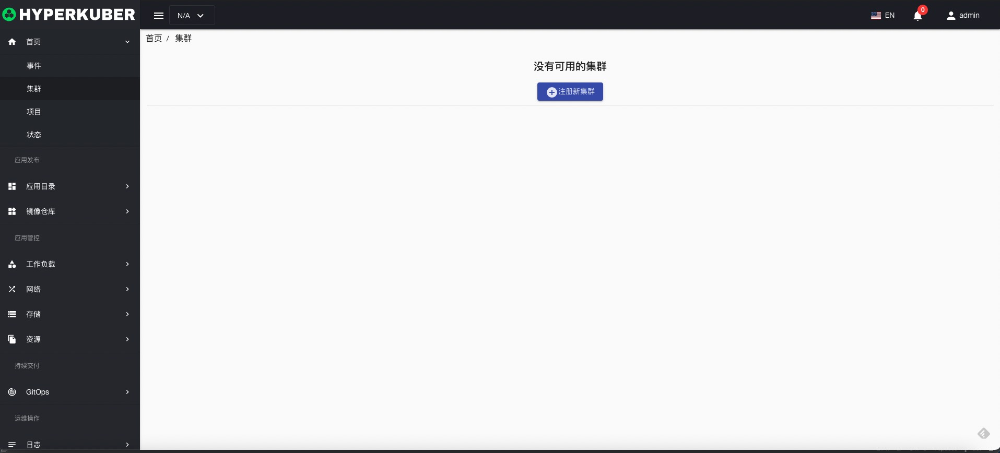
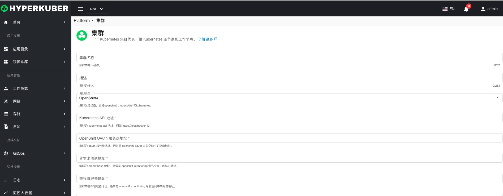

# 集群管理

HyperKuber支持多集群管理，用户可以注册Kubernetes或者Openshift集群，通过Hyperkuber实现多集群管理。

## 注册集群
1，首次登陆Hyperkuber的管理控制台界面，请使用系统默认的用户名/密码登陆，登陆成功以后，显示集群注册页面

点击“注册新集群”按钮进入集群注册页面

2，登陆Hyperkuber的管理控制台界面，点击左侧菜单 “平台管理”-“集群”，进行集群管理操作。

填写注册集群必填参数

参数说明：
注：以下参数中的地址为Kubernetes Ingress或者Openshift Route，Hyperkuber的多集群管理是通过集群外访问的方式访问集群以及集群中的监控，日志，告警等服务
* 集群名称： 用户集群的名称
* 描述：用户集群的描述
* 集群类型： 目前支持Kubernetes，Openshift4，Openshift3
* ApiServer地址： Kubernetes，Openshift4，Openshift3集群的ApiServer地址，注意：填写完整的ApiServer地址：比如：https://localhost:6443
* Oauth服务器：如果用户集群选择是Openshift4，Openshift3的集群类型，此项为必填项。Openshift用户登陆获取Token，登陆Hyperkuber产品以及Openshift系统
* Prometheus地址：rometheus地址或者Thanos Query地址，用于监控数据的查询，建议安装Prometheus-Operator，地址：https://github.com/prometheus-operator/prometheus-operator, Helm Chart地址：https://github.com/prometheus-community/helm-charts/tree/main/charts/kube-prometheus-stack
* AlertManager地址：集群中AlertManager Api地址，类似Prometheus地址。用于告警相关的显示以及处理
* ElasticSearch地址：集群中ElasticSearch Api地址
* Jenkins地址：集群中Jenkins Server地址
* Istio Prometheus地址： 集群中Istio安装Prometheus的地址
* Kiali地址：集群中Istio安装Kiali的地址
* Jaeger地址：集群中Istio安装Jaeger的地址
* 启用集群： 集群是否启用
* Cluster Token：集群类型是Kubernetes类型，需要获取有ClusterAdmin权限的ServiceAccount的Token，例如：
```
## 在kube-system的命名空间下创建hyperkuber的serviceaccount(not kube-system)
kubectl -n kube-system create serviceaccount hyperkuber

## 创建ClusterRoleBinding 
kubectl create clusterrolebinding hyperkuber-cluster-admin --clusterrole=cluster-admin --serviceaccount=kube-system:hyperkuber

## 获取TokenName
TOKENNAME=`kubectl -n kube-system get serviceaccount/hyperkuber -o jsonpath='{.secrets[0].name}'`

## 获取Token
kubectl -n kube-system get secret $TOKENNAME -o jsonpath='{.data.token}' | base64 --decode
##
将上面命令行输出的token结果，复制，粘贴到ClusterToken的输入框中
```

## 集群操作
1，启用/禁用
2，编辑
3，删除
