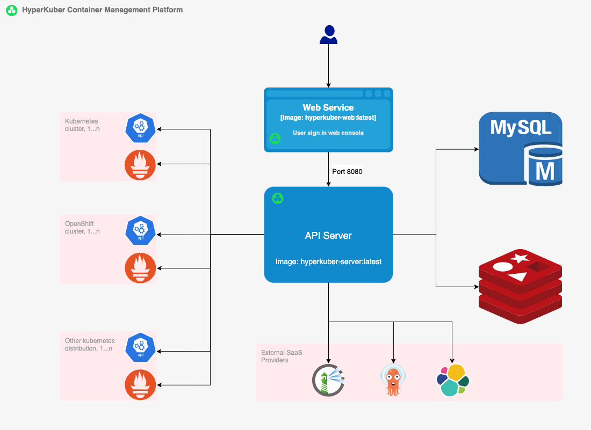
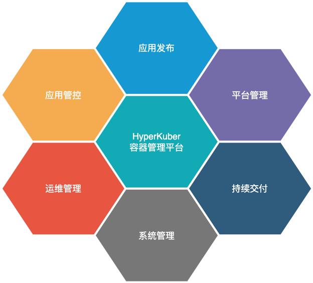
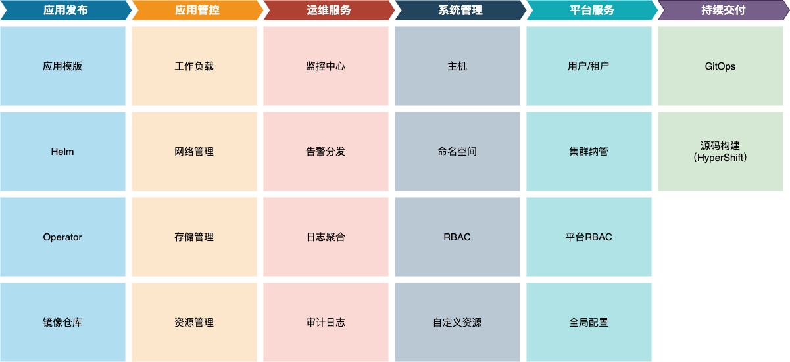

# 架构

HyperKuber 容器管理平台由四个组件组成，分别为前端Web服务，后端API服务，数据库服务(MySQL)和缓存(Redis)服务。

HyperKuber 支持灵活的部署方式，其组件均已支持容器化部署。 所有组件既可以部署在集群里，也可以单独部署在集群外部，比如用docker compose的方式。
HyperKuber Web服务和API Server服务均为无状态服务，可横向扩展，支持多副本的方式提供高可用和分流。当生产环境部署时， 可配置采用外部高可用的MySQL集群和Redis集群。

## 安全合规

HyperKuber 在新版本发布的时候，其Web服务镜像和API Server镜像均已经过安全扫描，以确保其无CVE脆弱性。 API Server服务和Kubernetes集群通信时支持TLS加密通信。 HyperKuber支持离线的方式部署安装，其所有件在离线方式下均可正常工作。 HyperKuber在除License激活所需数据外，不论是在安装还是运行时，都不会收集任何客户数据，完全兼容GDPR。详情可参考我们的[隐私策略](https://www.sheencloud.com/privacy-policy/).

# 功能特性

## 功能概览

HyperKuber 的核心功能可以概括为以下六个维度：

每一个维度包含的功能集如下:

## 功能特性

+ ### 多集群管理

HyperKuber 支持对多集群的统一管理，应用多集群一键发布。无论集群位于本地数据中心还是公有云，只要网络可达，HyperKuber均可管理。同时，HyperKuber提供平台级别的RBAC功能，在多集群环境下，不必再依赖于Kubernetes的RBAC来维护用户的角色和权限分配，减少运维压力，提高安全性和可维护性。

+ ### 实时可观察性

HyperKuber 支持实时监视集群资源，事件，日志等。实时掌握集群资源状态，便于调试和问题调查。

+ ### 资源拓扑

HyperKuber 支持Kubernetes资源拓扑展示，资源依赖关系和状态一眼可见。支持应用拓扑，资源拓扑和命名空间拓扑。

+ ### 强大易用

HyperKuber提供丰富的资源创建向导功能，对于初学者即使不了解YAML也可以操作管理资源，对于Kubernetes高级管理人员，在提供向导，表单创建资源的同时，仍然保留YAML编辑功能，仍可通过YAML管理资源生命周期。

+ ### 租户支持

HyperKuber 提供二级多租户管理功能，一级为命名空间级别，在命名空间基础上，提供二级多租户资源管控，租户资源可跨集群管理分配。

+ ### 无代理服务（Agentless）

HyperKuber 在其架构设计上采用无代理的实现方式，即无需在被管理的集群上部署任何的代理组件服务，不占用被管理集群资源。除某些使用场景外（如webhook认证，非必须），被管理集群无需做任何配置改动，只需要保证API Server服务和被管理集群的网络联通性即可。