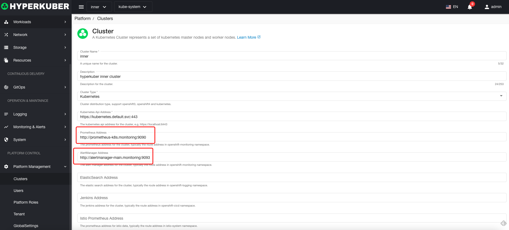
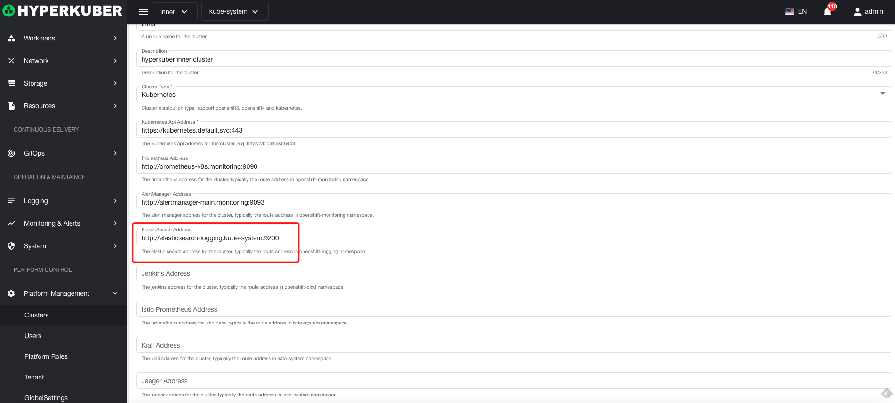
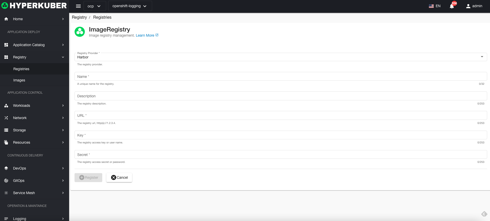
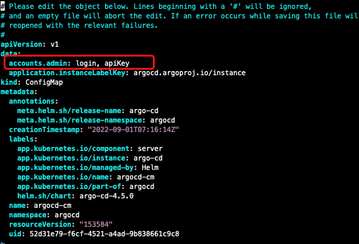
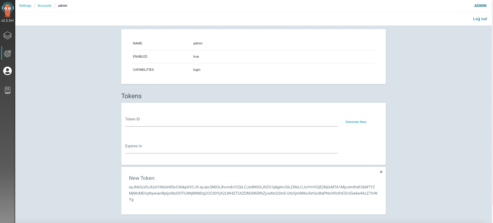

# Install

Basically, HyperKuber can be installed independently without any software, but for normal monitoring, prometheus or prometheus stack is required.

List of services that can be installed for more functionality (not required, but recommended).

+ ## Prometheus
   For metrics and monitoring systems
````
# helm install (https://artifacthub.io/packages/helm/prometheus-community/kube-prometheus-stack)

helm repo add prometheus-community https://prometheus-community.github.io/helm-charts
helm install my-kube-prometheus-stack prometheus-community/kube-prometheus-stack --version 39.9.0 -n monitoring --create-namespace
````

+ ## ElasticSearch
   Used for logging system.
````
# helm install elasticsearch (https://artifacthub.io/packages/helm/elastic/elasticsearch)

helm repo add elastic https://helm.elastic.co
helm install my-elasticsearch elastic/elasticsearch --version 7.17.3 -n logging --create-namespace

# helm install kibana (https://artifacthub.io/packages/helm/elastic/kibana)

helm repo add elastic https://helm.elastic.co
helm install my-kibana elastic/kibana --version 7.17.3 -n logging --create-namespace

# helm install filebeat (https://artifacthub.io/packages/helm/elastic/filebeat)

helm repo add elastic https://helm.elastic.co
helm install my-filebeat elastic/filebeat --version 7.17.3 -n logging --create-namespace
````

+ ## Harbor
  For registry and images management.
````
# helm installation (https://artifacthub.io/packages/helm/harbor/harbor)

helm repo add harbor https://helm.goharbor.io
helm install my-harbor harbor/harbor --version 1.9.3 -n harbor --create-namespace
````

+ ## ArgoCD
    For GitOps systems.
````
# helm install (https://artifacthub.io/packages/helm/argo/argo-cd)

helm repo add argo https://argoproj.github.io/argo-helm
helm install my-argo-cd argo/argo-cd --version 5.3.6
````

# configure

If Prometheus, ES, Argocd, Harbor and hyperkuber deploy the same cluster, the configuration can fill in the service address + port. If it is not the same cluster, you need to configure Ingress (Openshift platform configuration Route), the following configuration service address + port
+ ## Prometheus
   The default built-in inner cluster has no prometheus and alertmanager configuration, open the menu: platform management-cluster-edit, enter the cluster edit page to modify



+ ## ElasticSearch
   The default built-in inner cluster has no elasticsearch configuration, open the menu: platform management - cluster - edit, enter the cluster edit page to modify



+ ## Harbor
   By default, the built-in inner cluster has no harbor configuration. Open the menu: Mirror Warehouse - Mirror Warehouse - Connect Mirror Warehouse, and enter the Link Mirror Warehouse page to fill in



+ ## ArgoCD
    The default built-in inner cluster has no argocd configuration, open the menu: Platform Management - Global Configuration - Basic Configuration, select Gitops to fill in the configuration
    Gitops server: Ingress of server in argocd (Route in Openshift platform)
    

Note: The token acquisition method of argocd is 1, which is obtained by logging in to the argocd server through the browser.
1. Get the argocd server login password
````
kubectl -n argocd get secret argocd-initial-admin-secret -o jsonpath="{.data.password}" | base64 -d
````
2. Modify the configmap permissions of argocd


````
## Increase
 accounts.admin: login, apiKey
````
3. Log in through the browser, click Settings - User - "Generate New" to generate a Token

