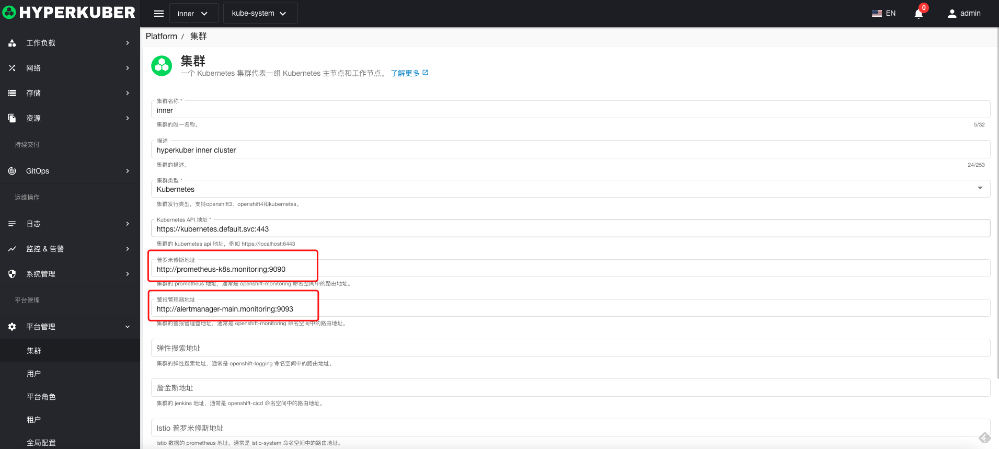
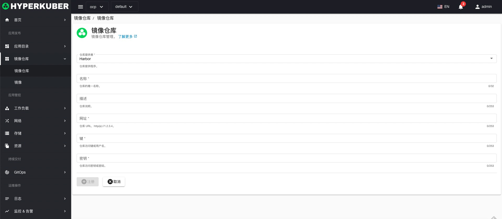

# 安装

基本上HyperKuber可以独立安装，不需要任何软件，但是要正常监控，需要prometheus或者prometheus stack。

可以安装以获得更多功能的服务列表（不是必需的，但推荐）。

+ ## Prometheus
   对于指标和监控系统
```
# helm安装 (https://artifacthub.io/packages/helm/prometheus-community/kube-prometheus-stack)

helm repo add prometheus-community https://prometheus-community.github.io/helm-charts
helm install my-kube-prometheus-stack prometheus-community/kube-prometheus-stack --version 39.9.0 -n monitoring --create-namespace
```

+ ## ElasticSearch
   用于日志系统。
```
# helm安装 elasticsearch (https://artifacthub.io/packages/helm/elastic/elasticsearch)

helm repo add elastic https://helm.elastic.co
helm install my-elasticsearch elastic/elasticsearch --version 7.17.3 -n logging --create-namespace

# helm安装 kibana (https://artifacthub.io/packages/helm/elastic/kibana)

helm repo add elastic https://helm.elastic.co
helm install my-kibana elastic/kibana --version 7.17.3 -n logging --create-namespace

# helm安装 filebeat (https://artifacthub.io/packages/helm/elastic/filebeat)

helm repo add elastic https://helm.elastic.co
helm install my-filebeat elastic/filebeat --version 7.17.3 -n logging --create-namespace
```

+ ## Harbor
  用于仓库管理。
```
# helm安装  (https://artifacthub.io/packages/helm/harbor/harbor)

helm repo add harbor https://helm.goharbor.io
helm install my-harbor harbor/harbor --version 1.9.3 -n harbor --create-namespace
```

+ ## ArgoCD
    对于 GitOps 系统。
```
# helm安装 (https://artifacthub.io/packages/helm/argo/argo-cd)

helm repo add argo https://argoproj.github.io/argo-helm
helm install my-argo-cd argo/argo-cd --version 5.3.6
```

# 配置

如果Prometheus，ES，Argocd，Harbor与hyperkuber部署同一集群，配置可以填写服务地址+端口，如果不是同一集群，需配置Ingress（Openshift平台配置Route），以下配置服务地址+端口
+ ## Prometheus
   默认内置inner集群无prometheus与alertmanager配置，打开菜单：平台管理-集群-编辑，进入集群编辑页面进行修改



+ ## ElasticSearch
   默认内置inner集群无elasticsearch配置，打开菜单：平台管理-集群-编辑，进入集群编辑页面进行修改


+ ## Harbor
   默认内置inner集群无harbor配置，打开菜单：镜像仓库-镜像仓库-连接镜像仓库，进入链接镜像仓库页面进行填写



+ ## ArgoCD
    默认内置inner集群无argocd配置，打开菜单：平台管理-全局配置-基本配置，选择Gitops进行填写配置
    Gitops服务器：argocd中server的Ingress（Openshift平台中Route）
    

注：argocd的token获取方式1，通过浏览器登录argocd server获取
1，获取argocd server登录密码
```
kubectl -n argocd get secret argocd-initial-admin-secret -o jsonpath="{.data.password}" | base64 -d
```
2，修改argocd的configmap权限


```
## 增加
 accounts.admin: login, apiKey
```
3，通过浏览器登录，点击 设置-用户-“Generate New” 即可生成Token

