# Application

The application provides application templates, which contain required and configurable resources. Users can customize and arrange private application templates. After the orchestration is completed, private applications can be set as public applications.
Orchestrated private applications or shared applications can be published to multiple clusters

## public application

Click the "Application Directory" menu on the left - "Public", the common application means that all users can view and use it
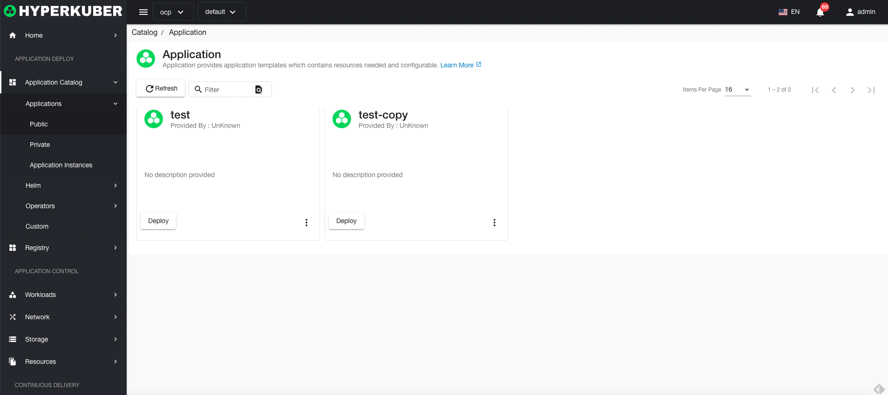
### Common application operations
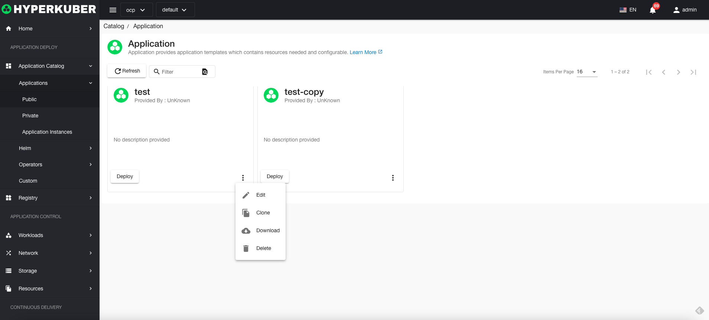
#### edit

Select the application to be modified, click the "More" button, and click "Edit" to edit the selected application.
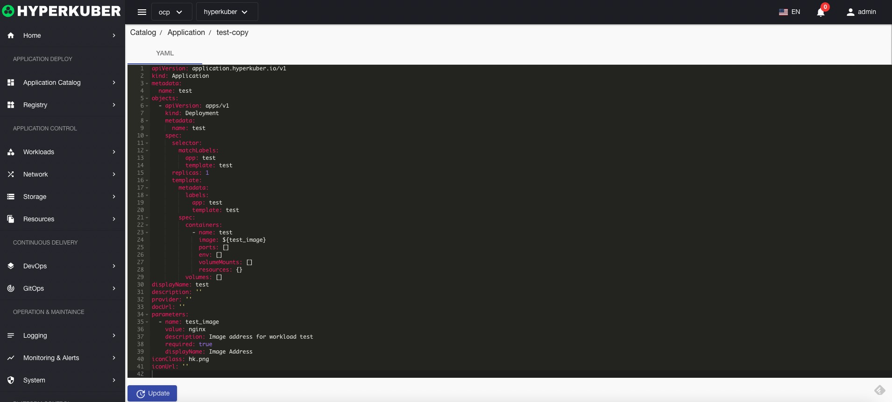
After editing, click the "Update" button to complete the editing operation.

#### clone
Select the application to be cloned, click the "More" button, and then click "Clone"
**Note: Cloning is to clone a private application that is connected to a public application. **

#### download
Download the Yaml file of the application, select the application to be cloned, click the "More" button, and click "Download".
#### delete
Select the application to be deleted, click the multi-select box to select, click the "Delete button", and enter "yes" in the confirmation input box to complete the deletion operation.
#### refresh
Click "Refresh" to complete the refresh of the application list.

## Private application
Click the "App Directory" menu on the left - "Private", the private app can only be viewed and used when the money is logged in to the user
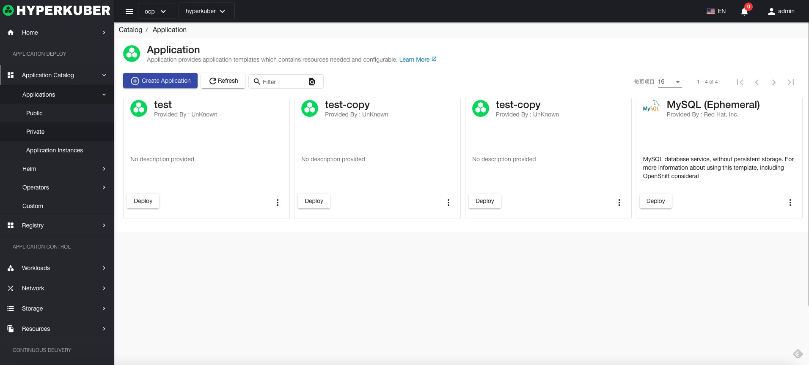
### Private application operations

#### Create application
Users can arrange and create applications, and click "Create Application" to enter the corresponding creation page.
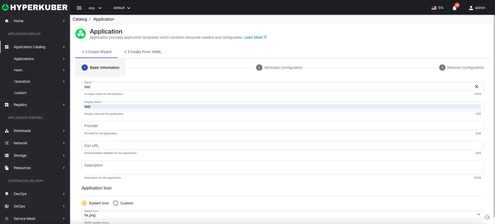
Basic parameter settings:
* name: the name of the user application template
* Display name: The display name of the user application template
* provider: provider name
* Document address: The URL address of the application document
* description: the description of the app
* Icon: the icon of the app

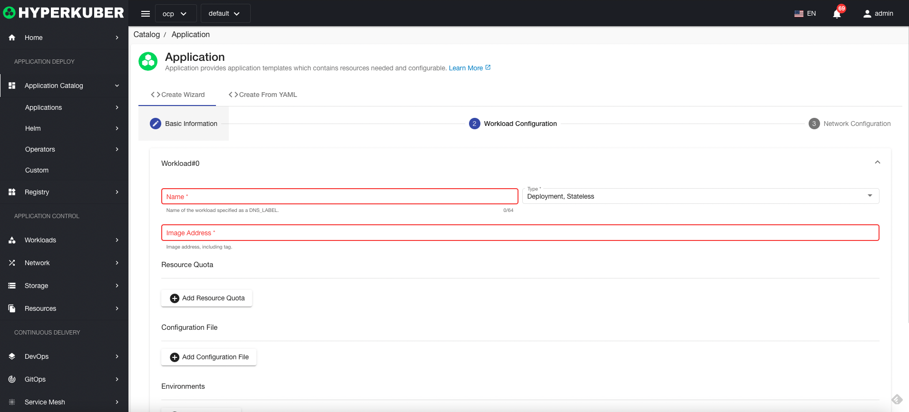

Workload - application parameter settings: support for multi-workload creation
* Workload Name: The name of the workload in the application
* Application type: Support Deployment, StatefulSet, DaemonSet, Job, Cronjob
* Resource quota: Set the application's CPU, memory allocation and usage
* Configuration file: ConfigMap is mounted to the application directory
* Environment variables: application environment variables
* Storage claims: persistent storage claims used in the application

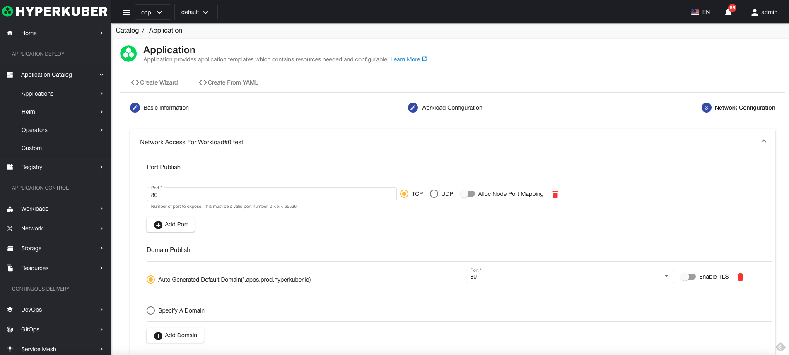
Workload - network parameter settings:
* Port release: Specify the port accessed within the application
* Domain name release: The application can use the system's own domain name by default, or a user-defined domain name. Support for enabling TLS.

#### Yaml create application
It supports creating applications from Yaml files. It is recommended to follow the process to create a private application, download Yaml, and check the syntax and writing format of the Yaml application.

#### edit

Select the application to be modified, click the "More" button, and click "Edit" to edit the selected application.

After editing, click the "Update" button to complete the editing operation.

#### Total
Select the application to be disclosed and click the "Shared" button to complete the disclosure of the private application to the shared application.

#### clone
Select the application to be cloned, click the "More" button, and then click "Clone".
**Note: Cloning is to clone a private application that is connected to a public application. **

#### download
Download the Yaml file of the application, select the application to be cloned, click the "More" button, and click "Download".
#### delete
Select the application to be deleted, click the multi-select box to select, click the "Delete button", and enter "yes" in the confirmation input box to complete the deletion operation.

#### refresh
Click "Refresh" to complete the refresh of the application list.

## Applications

#### Create application instance
Click the "Deploy" button of a public application or a private application to enter the corresponding deployment page.
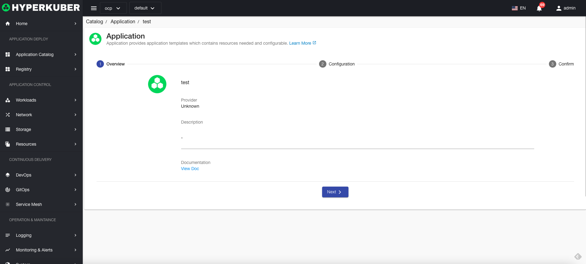
Basic parameter settings:
* none

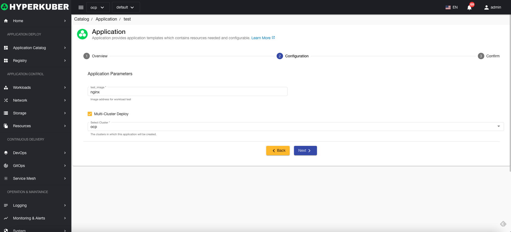

Workload-application parameter settings: support multiple cluster creation
* Workload Image Name: The image name of the workload in the application
* Multi-cluster selection: support multi-cluster publishing applications

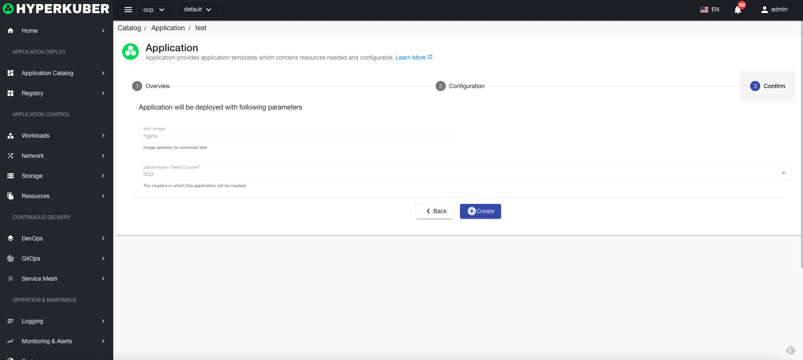
Parameter confirmation, create.

#### Application example details

Select the application instance to be displayed and click the "Instance Name" link to enter the application instance details page.
Application instance topology information
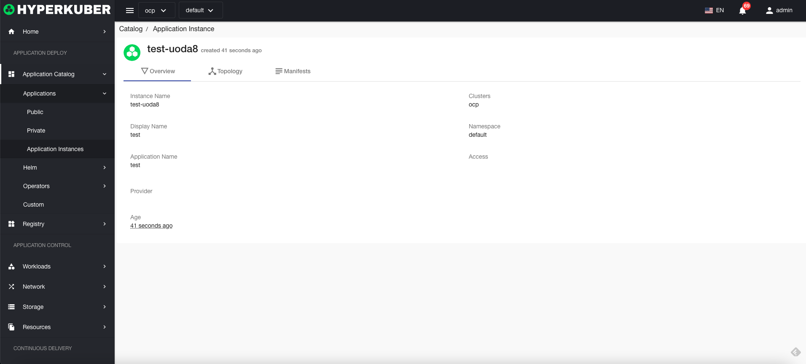
Yaml information of the application instance
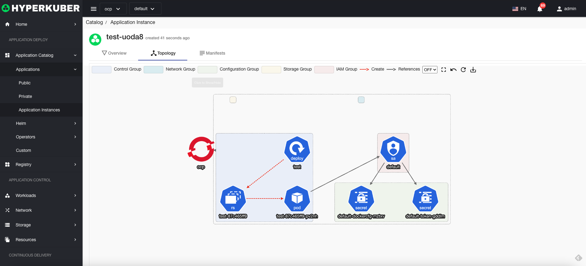
Overview information for application examples
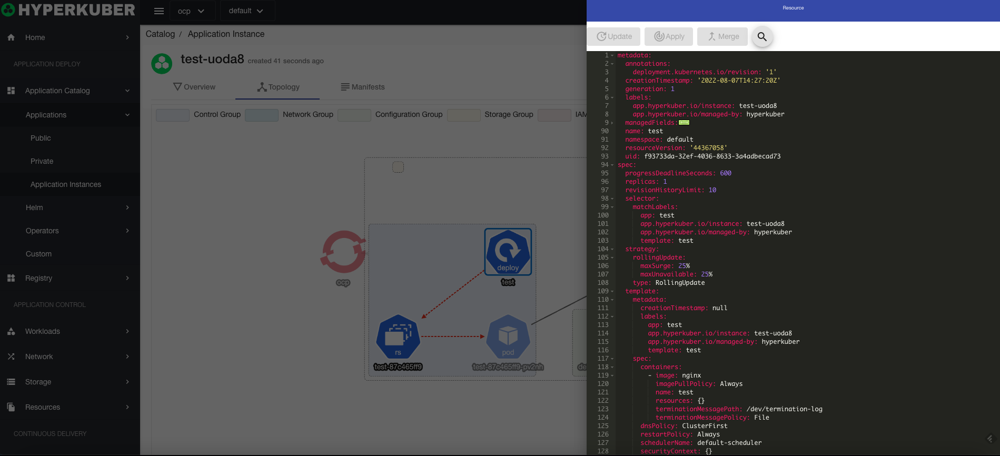

#### delete
Select the application to be deleted, click the multi-select box to select, click the "Delete button", and enter "yes" in the confirmation input box to complete the deletion operation.

#### refresh
Click "Refresh" to complete the refresh of the application list.