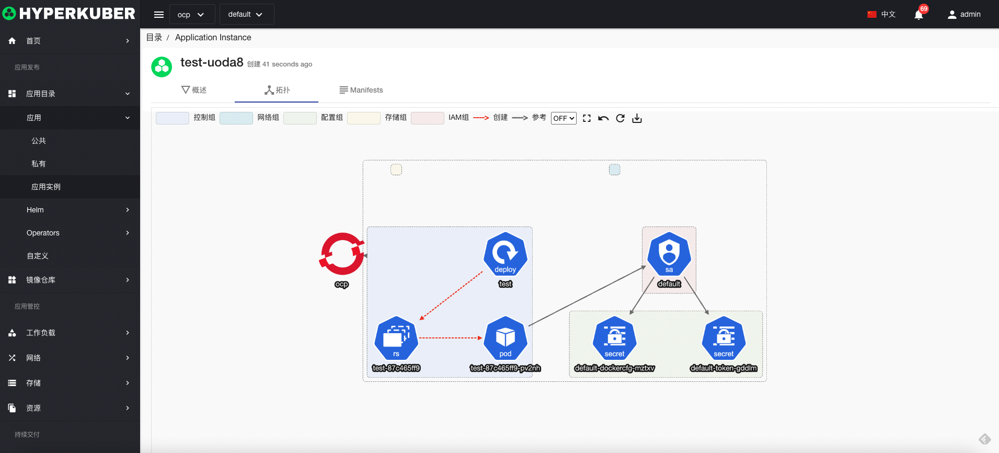

# 应用

应用程序提供应用程序模板，其中包含所需和可配置的资源，用户可以自定义编排私有应用模版，编排完成后，可以将私有应用设置为公共应用
编排完成的私有应用或者共有应用可以应用发布至多集群

## 公共应用

点击左侧“应用目录”菜单-“公共”，共有应用即全部用户均查看以及使用

### 共有应用操作
#### 编辑

选择需要修改的应用，点击“更多”的按钮，点击“编辑”，即可对选择的应用进行编辑。

编辑完成，点击“更新”按钮，完成编辑操作。

#### 克隆
选择需要克隆的应用，点击“更多”的按钮，点击“克隆”即可
**注：克隆是将公用应用对接的私有应用进行克隆。**

#### 下载
将应用的Yaml文件进行下载，选择需要克隆的应用，点击“更多”的按钮，点击“下载”即可
#### 删除
选择需要删除的应用，点击多选框选择，点击“删除按钮”，在确定输入框输入“yes”，即可完成删除操作。
#### 刷新
点击“刷新”，即可完成应用列表的刷新。

## 私有应用
点击左侧“应用目录”菜单-“私有”，私有应用只能当钱登陆用户查看以及使用

### 私有应用操作

#### 创建应用
用户可以编排创建应用，点击“创建应用”，进入相应的创建页面。

基本参数设置：
* 名称： 用户应用模版的名称
* 显示名称： 用户应用模版的显示名称
* 提供者：提供者名称
* 文档地址：应用文档的URL地址
* 描述：应用的描述
* 图标：应用的图标

工作负载-应用参数设置：支持多工作负载创建
* 工作负载名称： 应用中工作负载的名称
* 应用类型：支持Deployment，StatefulSet，DaemonSet，Job，Cronjob
* 资源配额：设置应用的CPU，内存的分配以及使用
* 配置文件：ConfigMap挂载至应用目录
* 环境变量：应用的环境变量
* 存储声明：应用中使用的持久化存储声明

工作负载-网络参数设置：
* 端口发布： 指定应用内部访问的端口
* 域名发布： 应用可以默认使用系统自带域名，也可用户自定义域名。支持启用TLS。

#### Yaml创建应用
支持从Yaml文件创建应用，建议先按照流程创建私用应用，下载Yaml，查看Yaml应用的语法以及编写格式。

#### 编辑

选择需要修改的应用，点击“更多”的按钮，点击“编辑”，即可对选择的应用进行编辑。

编辑完成，点击“更新”按钮，完成编辑操作。

#### 共有
选择需要公开的应用，点击“共有”的按钮，即可完成将私有应用公开至共有应用。

#### 克隆
选择需要克隆的应用，点击“更多”的按钮，点击“克隆”即可。
**注：克隆是将公用应用对接的私有应用进行克隆。**

#### 下载
将应用的Yaml文件进行下载，选择需要克隆的应用，点击“更多”的按钮，点击“下载”即可
#### 删除
选择需要删除的应用，点击多选框选择，点击“删除按钮”，在确定输入框输入“yes”，即可完成删除操作。

#### 刷新
点击“刷新”，即可完成应用列表的刷新。

## 应用实例

#### 创建应用实例
点击共有应用或者私有应用的“部署”按钮，进入相应的部署页面。

基本参数设置：
* 无

工作负载-应用参数设置：支持多多集群创建
* 工作负载镜像名称： 应用中工作负载的镜像名称
* 多集群选择：支持多集群发布应用

参数确认，创建。

#### 应用实例详情

选择需要显示的应用实例，点击“实例名称”的链接，即可进入应用实例的详情页面。
应用实例的拓扑信息

应用实例的Yaml信息

应用实例的概述信息

#### 删除
选择需要删除的应用，点击多选框选择，点击“删除按钮”，在确定输入框输入“yes”，即可完成删除操作。

#### 刷新
点击“刷新”，即可完成应用列表的刷新。