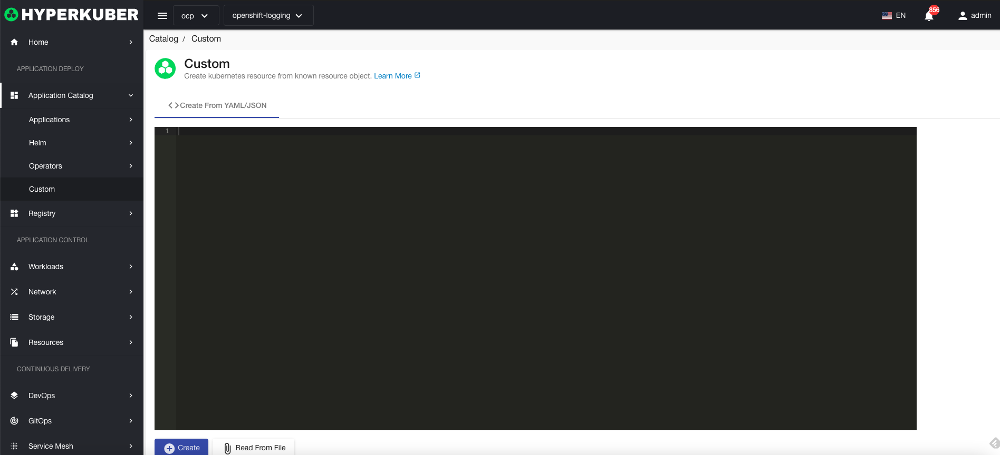

# Custom

## create

### Via Yaml/Json
The user can paste the Yaml/Json defined by the Operator, and click "Create".
### via file
Click to upload the file, select the Yaml/Json file defined by the Operator, and click "Create".