# Helm app

## Helm Repositories repository
The helm Repositories repository is a repository where users store helm charts
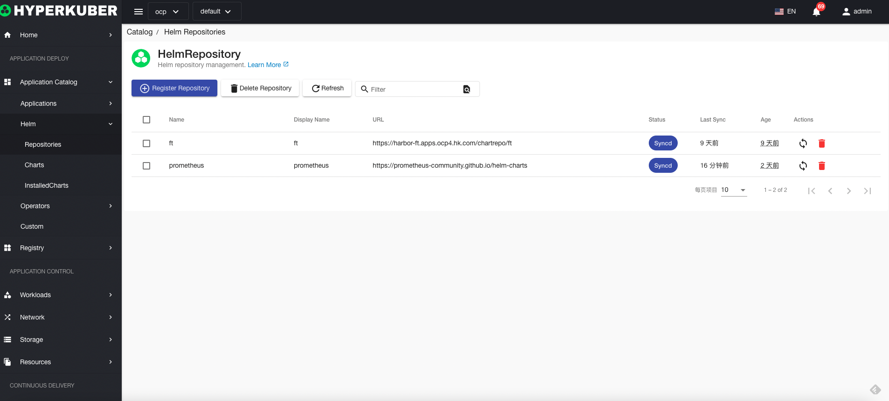
## Helm Repositories warehouse operations

Click the "Application Directory" - "Helm" menu on the left to enter the relevant page operation
### Register the repository
Click on "Register Repository"
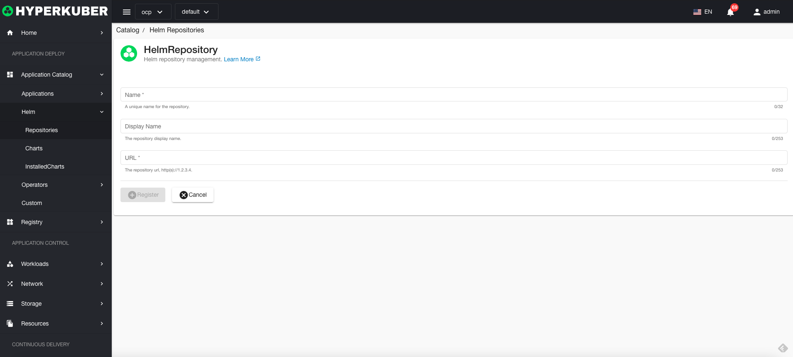
parameter settings:
* name: Repository repository name
* display name: Repository repository display name
* URL: Repository repository URL
### Sync repository
Click the "Sync" button to complete the sync operation. After the synchronization is completed, you can view all chart packages under the Repository in the "chart package" list.
### delete
Select the repository to be deleted, click the multi-select box to select, click the "Delete button", and enter "yes" in the confirmation input box to complete the deletion operation.
### refresh
Click "Refresh" to complete the refresh of the Repository list.

## Helm Chart Package
A helm chart is a chart that synchronizes the helm Repositories repository.
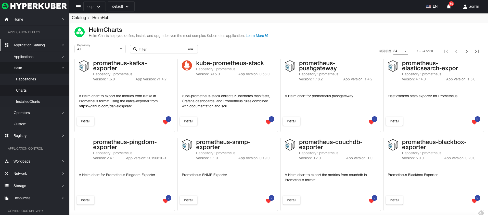
### Helm Chart Package Operations

Click the "App Directory" - "Charts" menu on the left to enter the relevant page operations
#### Install
Select the "Charts" menu, the chart package that needs to be installed, and click the "Install" button: the chart related information is displayed
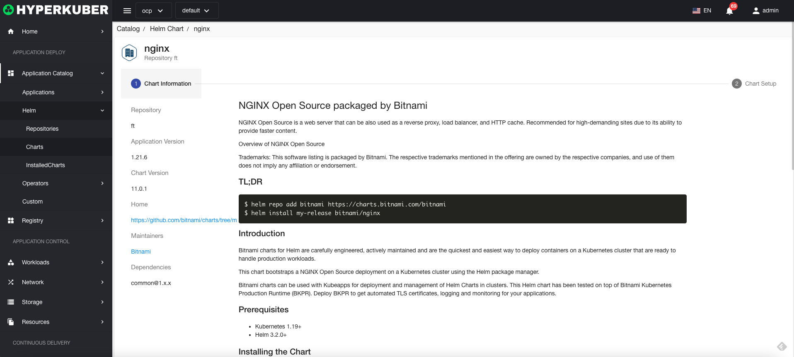
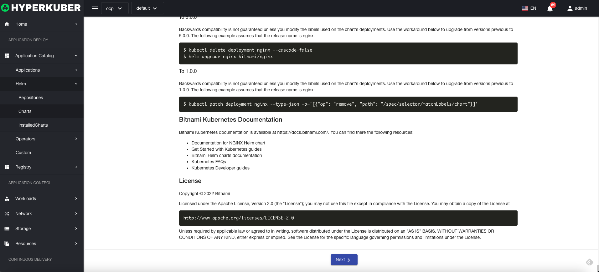
parameter settings:
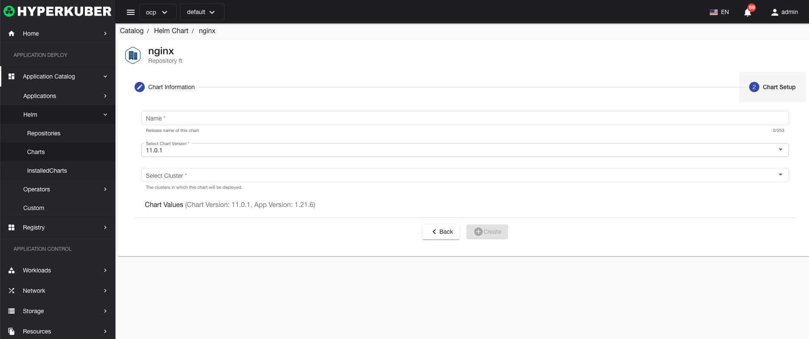
* name: Helm chart installation application name
* Version: Helm chart installation application version
* Install multiple clusters: Helm chart installs the target cluster

## InstalledCharts
Click the "Application Directory" - "InstalledCharts" menu on the left to enter the relevant page operation
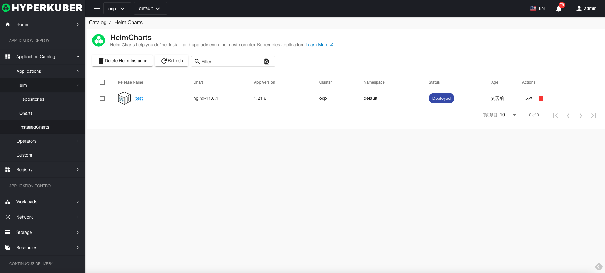
### InstalledCharts Actions

#### Details
Select the "InstalledCharts" menu, click the "Name" link: you can enter the details page.
Overview of installing the charts package
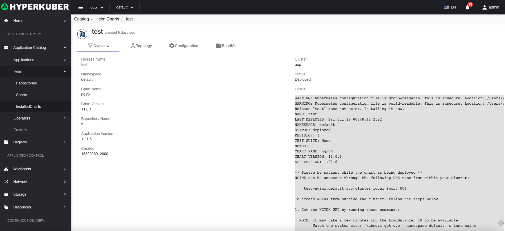
Install the topology information of the charts package
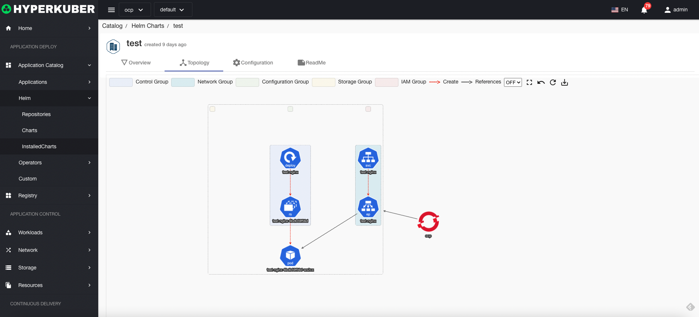
Install the configuration information of the charts package. You can modify the installed chart application here.
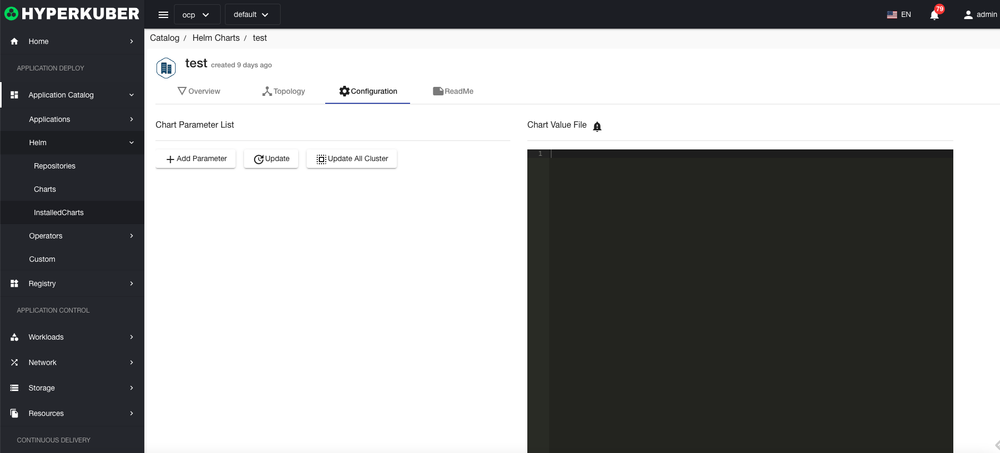
README.md information for installing the charts package
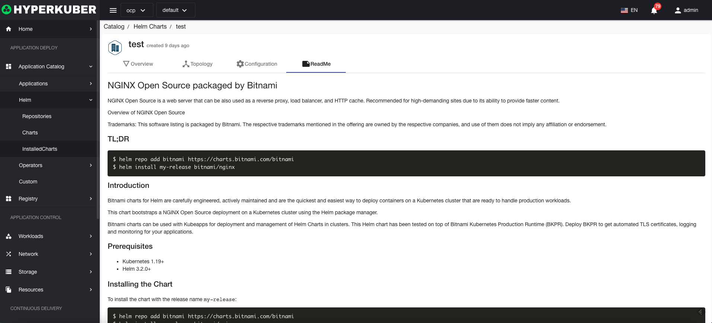

#### upgrade
Select the "InstalledCharts" menu, click the "Upgrade" button in the list page: you can enter the upgrade page.
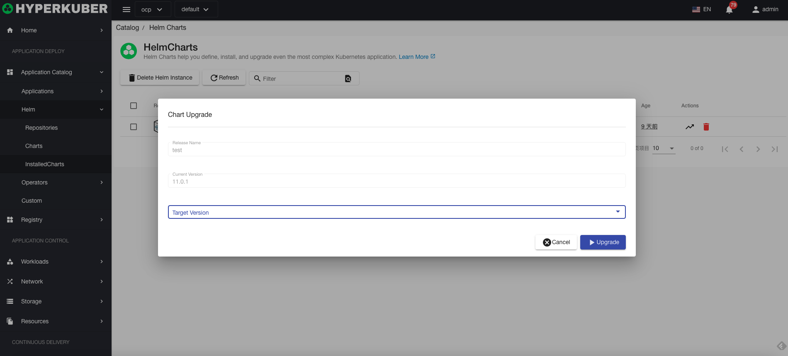
Select the upgraded version and click "Upgrade".
#### delete
Select the installed chart package to be deleted, click the multi-select box to select, click the "Delete button", and enter "yes" in the confirmation input box to complete the deletion operation.
#### refresh
Click "Refresh" to complete the refresh of the application list.