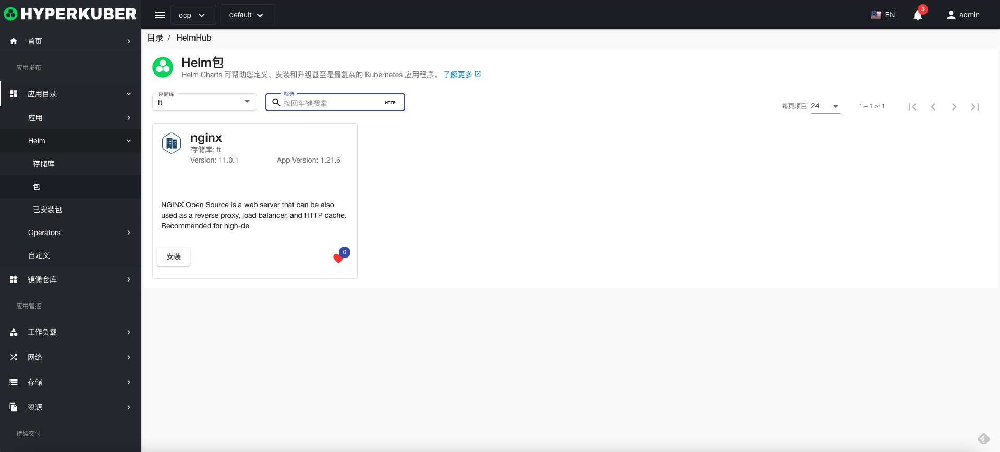
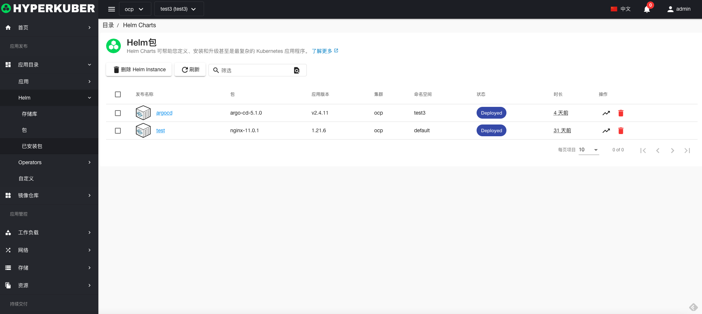
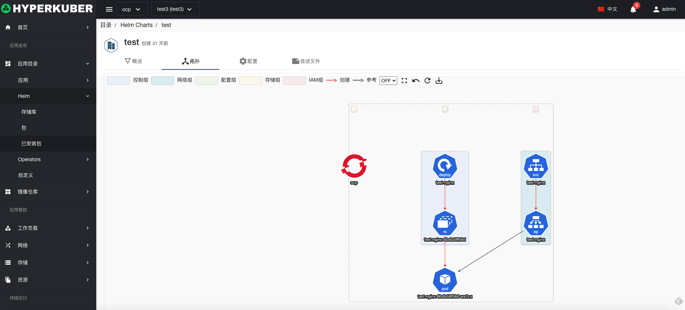
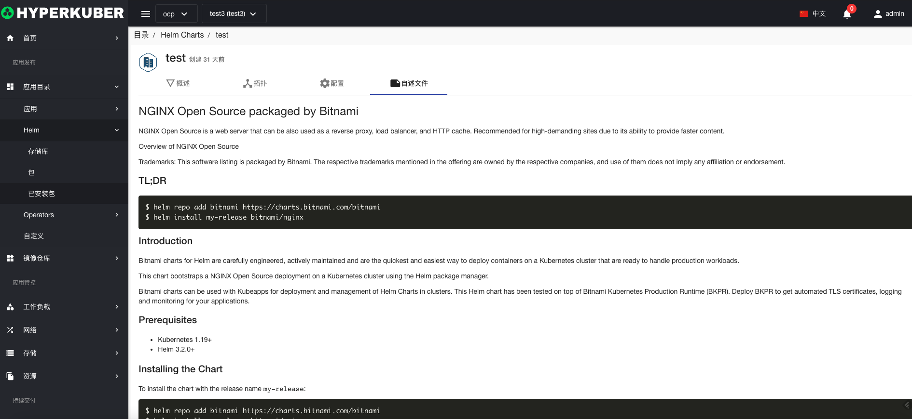

# Helm应用

## Helm Repositories仓库
helm Repositories仓库是用户存储helm chart的仓库

## Helm Repositories仓库操作

点击左侧”应用目录“-“Helm”菜单，进入相关页面操作
### 注册存储库
点击 “注册存储库”

参数设置：
* 名称： Repository存储库名称
* 显示名称： Repository存储库显示名称
* URL： Repository存储库URL
### 同步存储库
点击 “同步”按钮，完成同步操作。同步完成操作后，在“chart包”列表即可查看到该Repository下的全部chart包。
### 删除
选择需要删除的Repository，点击多选框选择，点击“删除按钮”，在确定输入框输入“yes”，即可完成删除操作。
### 刷新
点击“刷新”，即可完成Repository列表的刷新。

## Helm Chart包
helm chart是同步helm Repositories仓库的chart。

### Helm Chart包操作

点击左侧”应用目录“-“Charts”菜单，进入相关页面操作
#### 安装
选择"Charts”菜单,需要安装的chart包，点击 “安装”按钮：chart相关信息显示

参数设置：

* 名称： Helm chart 安装应用名称
* 版本： Helm chart 安装应用版本
* 安装多集群： Helm chart 安装目标集群

## 已安装包
点击左侧”应用目录“-“InstalledCharts”菜单，进入相关页面操作

### 已安装包操作

#### 详情
选择"InstalledCharts”菜单,点击 “名称”连接：即可进入详情页面。
安装charts包的概览信息

安装charts包的拓扑信息

安装charts包的配置信息，此处可以对已安装的chart应用进行修改。

安装charts包的README.md信息

#### 升级
选择"InstalledCharts”菜单,点击 列表页面中的“升级”按钮：即可进入升级页面。

选择升级的版本，点击“升级”即可。
#### 删除
选择需要删除的已安装的chart包，点击多选框选择，点击“删除按钮”，在确定输入框输入“yes”，即可完成删除操作。
#### 刷新
点击“刷新”，即可完成应用列表的刷新。
