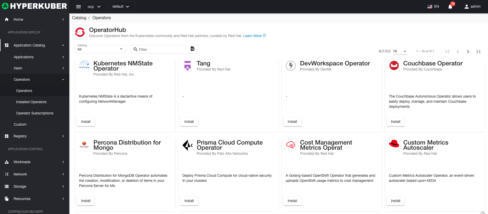

# Operator application

## Operators

## Operators operation

### Install
Select the "Operators" menu, the operator to be installed, click the "Install" button,

parameter settings:
* Installation method: the installation method of the operator, whether to specify the namespace
* Update channel: the installed version of the operator
* Approval strategy: support manual, automatic

## InstalledOperators
Select the "Operators" menu - "InstalledOperators" menu, enter the relevant page operation

### InstalledOperators operations

#### Details
Select the "InstalledOperators" menu, click the "Name" link: you can enter the details page.
Overview of installing the operator

Install operator event display

CRD display and operation in the installation operator

* Label
Support to modify the Label information of the Operator

*Annotations
Support to modify the Annotation information of Operator

* Yaml
Support to modify Yaml information of Operator

#### delete
Select the installed chart package to be deleted, click the multi-select box to select, click the "Delete button", and enter "yes" in the confirmation input box to complete the deletion operation.
#### refresh
Click "Refresh" to complete the refresh of the application list.

## Operator subscription

### Operator Subscription Operation

* Label
* Notes
* Yaml/Json editing

#### delete
Select the installed chart package to be deleted, click the multi-select box to select, click the "Delete button", and enter "yes" in the confirmation input box to complete the deletion operation.
#### refresh
Click "Refresh" to complete the refresh of the application list.