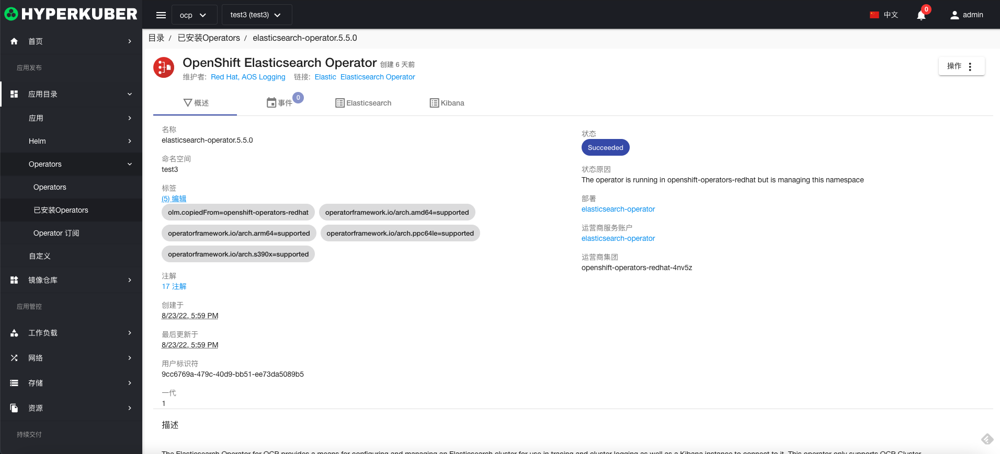
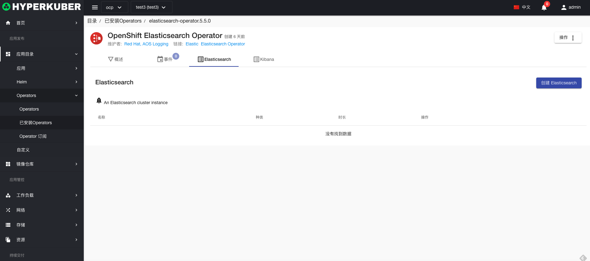

# Operator应用

## Operators

## Operators操作

### 安装
选择"Operators”菜单,需要安装的operator，点击 “安装”按钮,

参数设置：
* 安装方式： operator的安装方式，是否指定namespace
* 更新频道： operator的安装版本
* 审批策略： 支持手动，自动

## InstalledOperators
选择"Operators”菜单-“InstalledOperators”菜单，进入相关页面操作

### InstalledOperators操作

#### 详情
选择"InstalledOperators”菜单,点击 “名称”连接：即可进入详情页面。
安装operator的概览信息

安装operator事件显示

安装operator中CRD显示以及操作

* Label
支持修改Operator的Label信息

* Annotations
支持修改Operator的Annotation信息

* Yaml
支持修改Operator的Yaml信息

#### 删除
选择需要删除的已安装的chart包，点击多选框选择，点击“删除按钮”，在确定输入框输入“yes”，即可完成删除操作。
#### 刷新
点击“刷新”，即可完成应用列表的刷新。

## Operator订阅

### Operator订阅操作

* 标签
* 注解
* Yaml/Json编辑

#### 删除
选择需要删除的已安装的chart包，点击多选框选择，点击“删除按钮”，在确定输入框输入“yes”，即可完成删除操作。
#### 刷新
点击“刷新”，即可完成应用列表的刷新。

