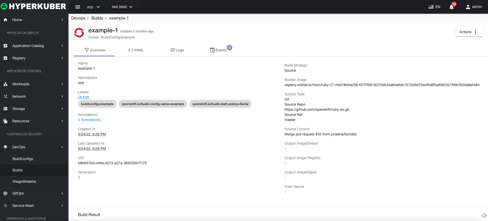
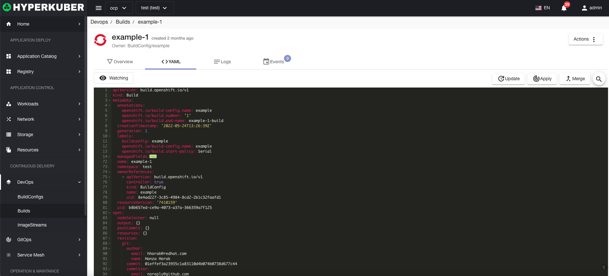
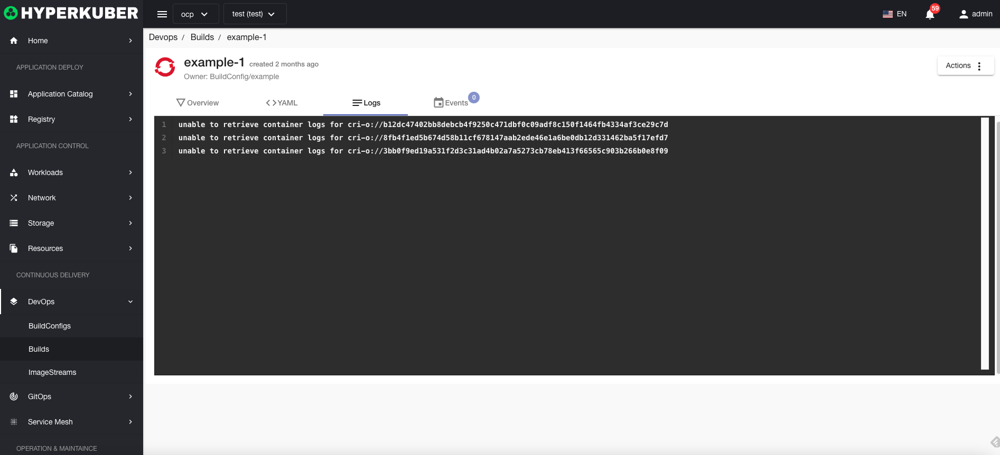
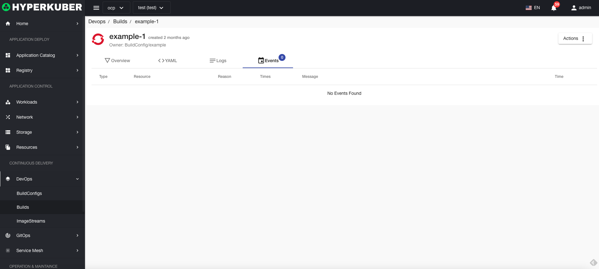

# Construct

Construction is the process of converting input arguments into a result object.

## build operation

The following interface graphical operations are supported:
* Cancel build
* rebuild
* Label
* Notes
* Yaml/Json editing

### Build Details
Click the link of the build name to go to the build details page
Overview information

Yaml information

build history

event information

### delete
Select the build to be deleted, click the multi-select box to select, click the "Delete button", and enter "yes" in the confirmation input box to complete the deletion operation.
### refresh
Click "Refresh" to complete the refresh of the build list.