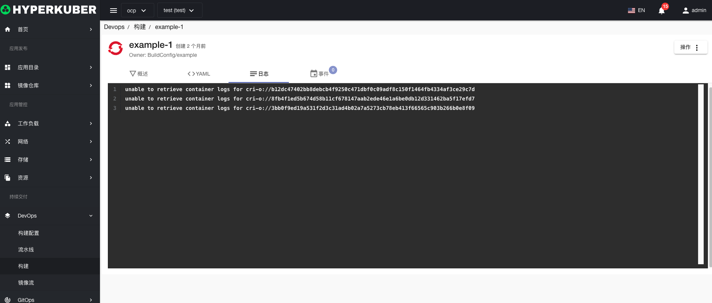

# 构建

构建是将输入参数转换为结果对象的过程。

## 构建操作

支持以下界面图形化操作：
* 取消构建
* 重新构建
* 标签
* 注解
* Yaml/Json编辑

### 构建详情
点击构建名称的链接，即可进入构建的详情页面
概览信息

Yaml信息

构建历史信息

环境信息

事件信息

### 删除
选择需要删除的构建，点击多选框选择，点击“删除按钮”，在确定输入框输入“yes”，即可完成删除操作。
### 刷新
点击“刷新”，即可完成构建列表的刷新。

