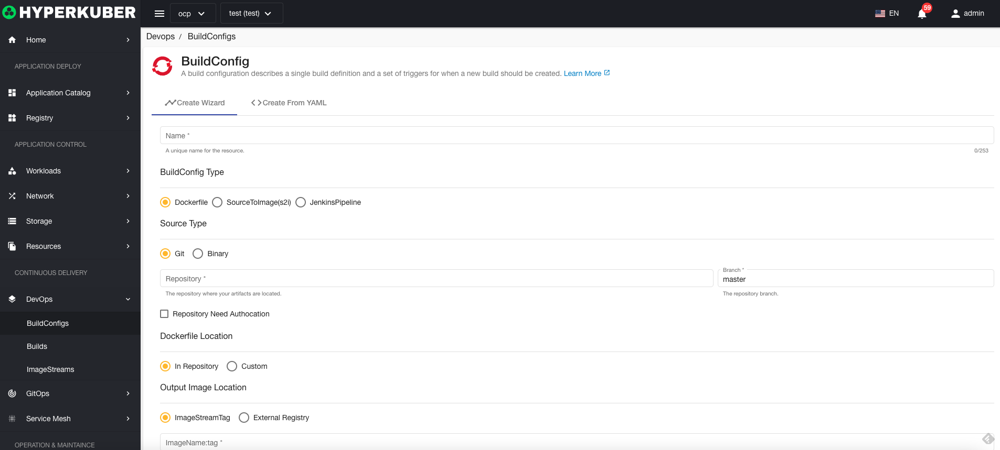
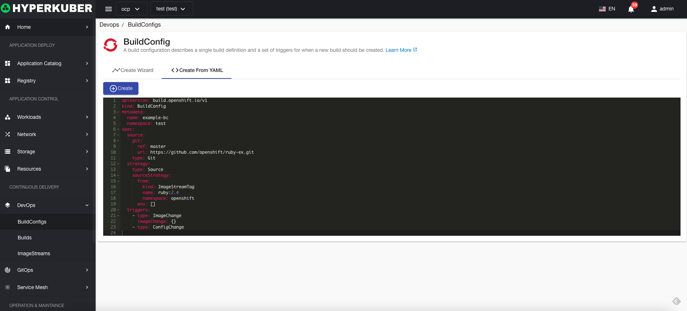
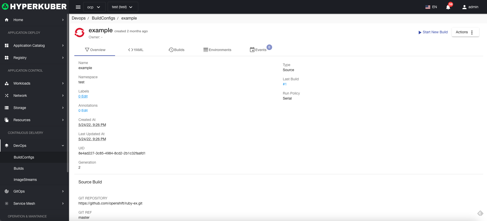
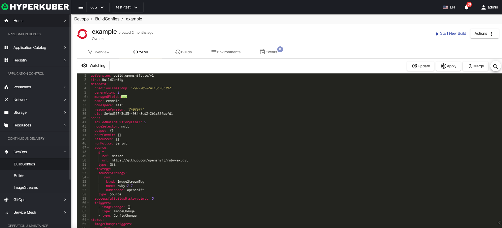
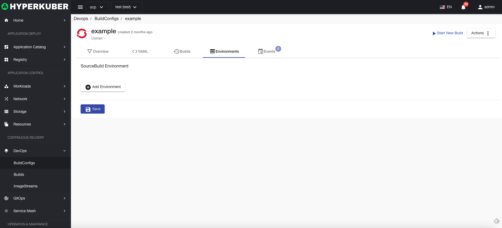

# build configuration

A build configuration describes a single build definition and a set of triggers for when a new build is created.

## Build configuration actions

The following interface graphical operations are supported:
* start the build
* Label
* Notes
* Yaml/Json editing

### Create
Create a build configuration, click the "Create Build Configuration" button, enter the Create Build Configuration page, and fill in the necessary parameters

parameter
name: build configuration name
Build Configuration Type: Support Dockerfile, SourceToImage, JenkinsPipeline
Source type: Git supported, binary
Dockerfile configuration: Dockerfile location
Output mirror location: the location name and tag of the output mirror
Click "Create" to do so.

### Yaml create
Build configurations can be created directly from Yaml files

### Build configuration details
Click the link of the build configuration name to enter the build configuration details page
Overview information

Yaml information

build history

Environmental information

event information

### delete
Select the build configuration to be deleted, click the multi-select box to select, click the "Delete button", and enter "yes" in the confirmation input box to complete the deletion operation.
### refresh
Click "Refresh" to complete the refresh of the build configuration list.