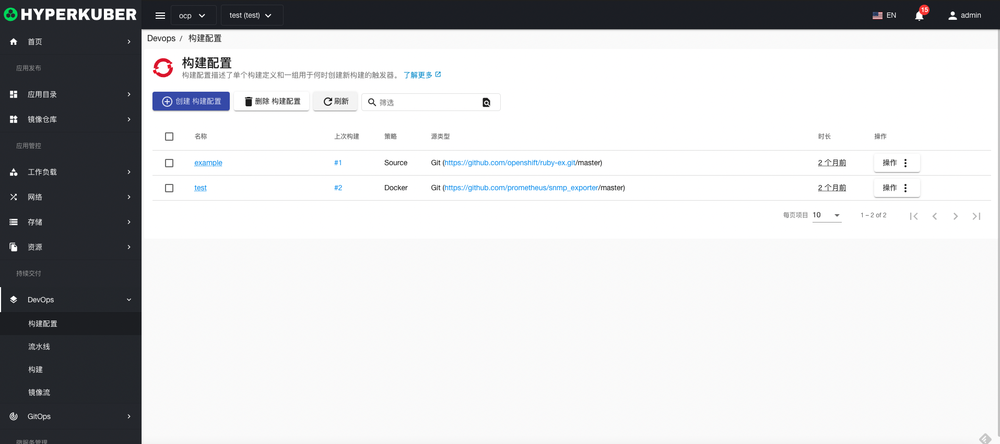
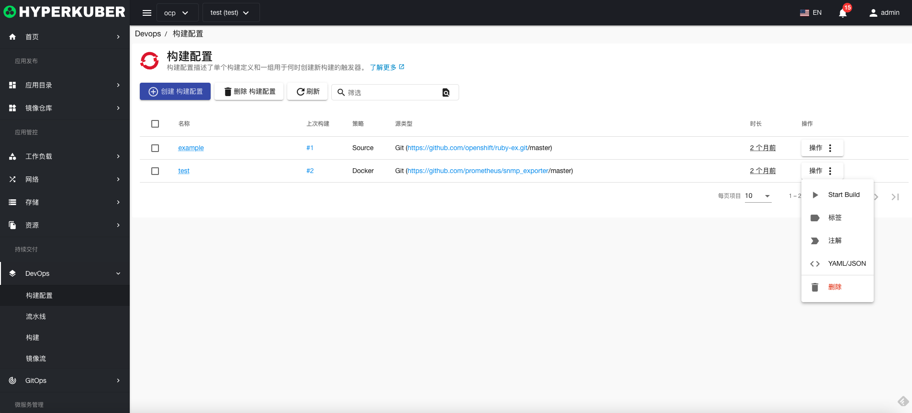
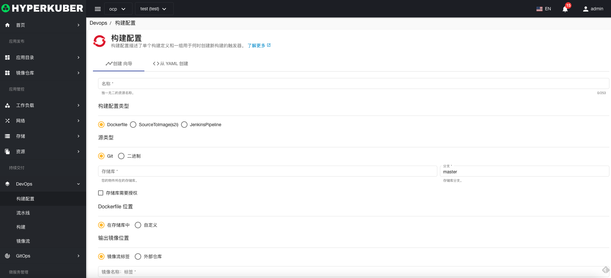
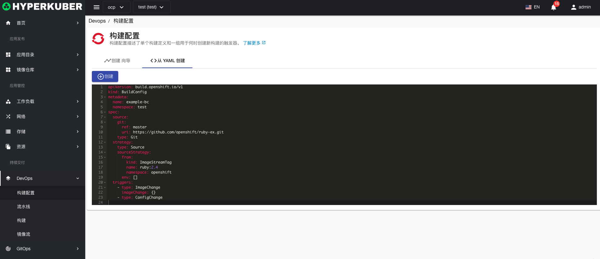
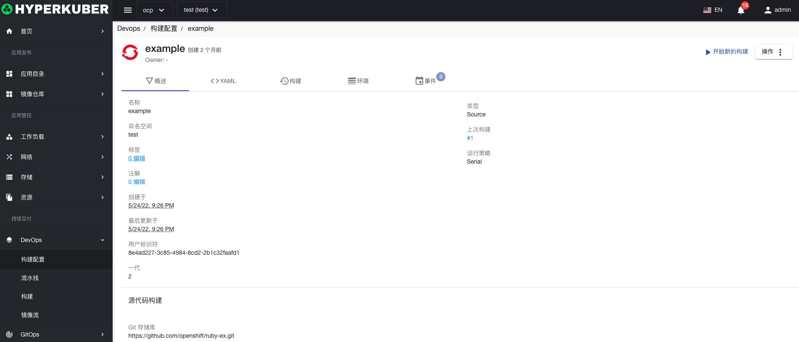
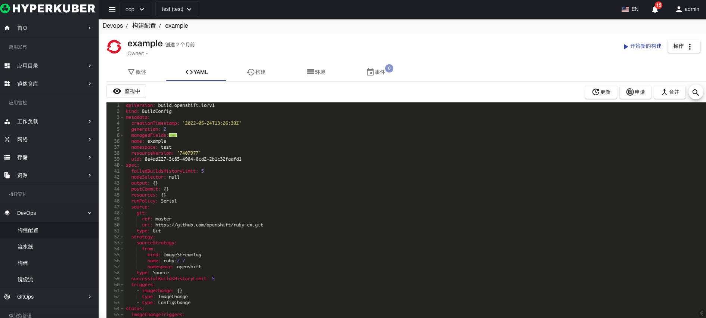
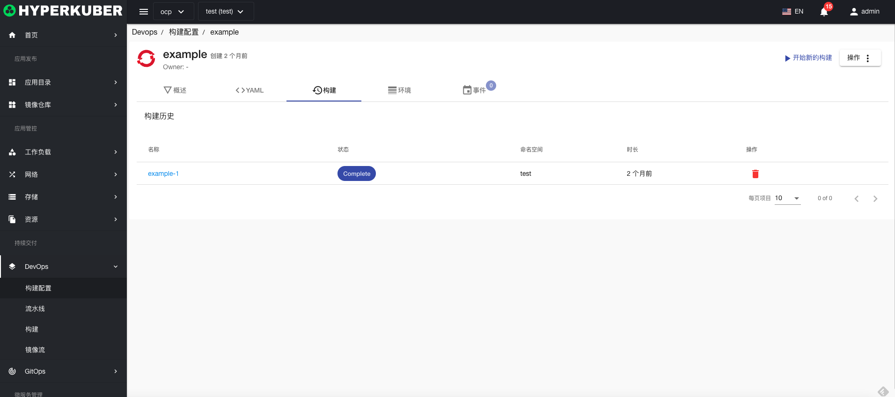
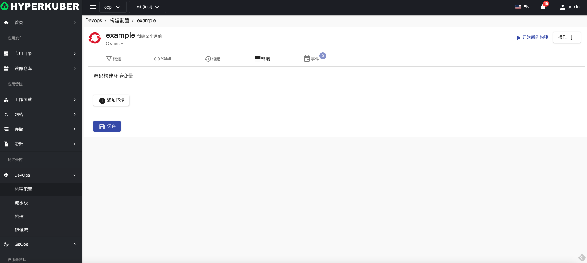
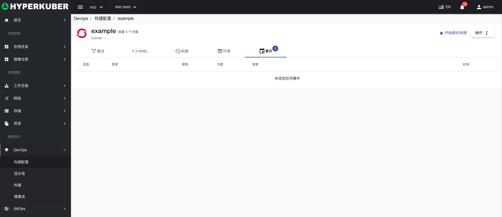

# 构建配置

构建配置描述了单个构建定义和一组用于何时创建新构建的触发器。

## 构建配置操作

支持以下界面图形化操作：
* 启动构建
* 标签
* 注解
* Yaml/Json编辑

### 创建
创建构建配置，点击“创建构建配置”按钮，进入创建构建配置页面，填写必要参数

参数
名称：构建配置名称
构建配置类型：支持Dockerfile，SourceToImage，JenkinsPipeline
源类型：支持Git，二进制
Dockerfile配置：Dockerfile位置
输出镜像位置：输出镜像的位置名称以及tag
点击“创建”即可。

### Yaml创建
构建配置可通过Yaml文件直接创建

### 构建配置详情
点击构建配置名称的链接，即可进入构建配置的详情页面
概览信息

Yaml信息

构建历史信息

环境信息

事件信息

### 删除
选择需要删除的构建配置，点击多选框选择，点击“删除按钮”，在确定输入框输入“yes”，即可完成删除操作。
### 刷新
点击“刷新”，即可完成构建配置列表的刷新。

