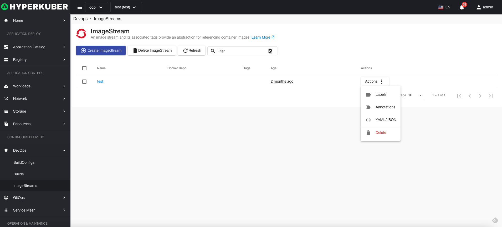
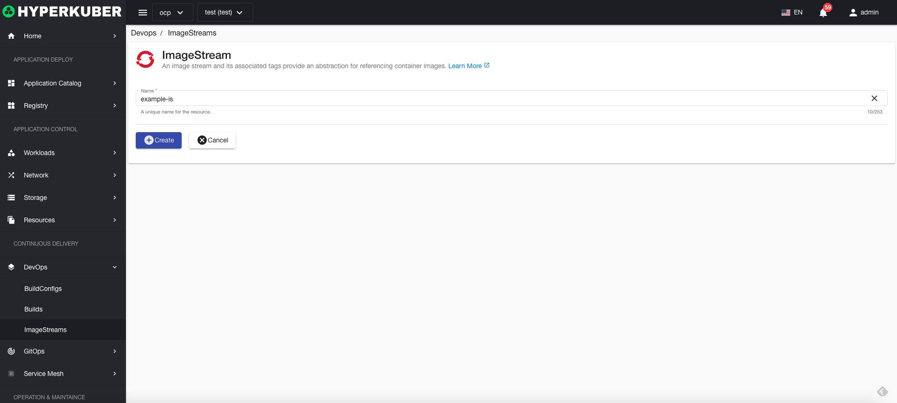
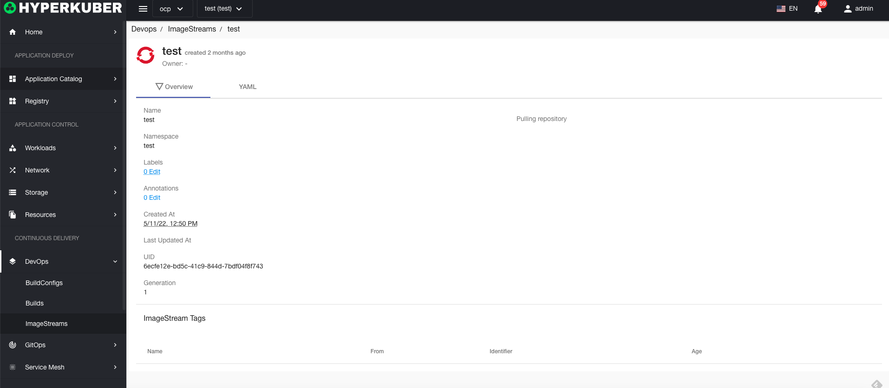
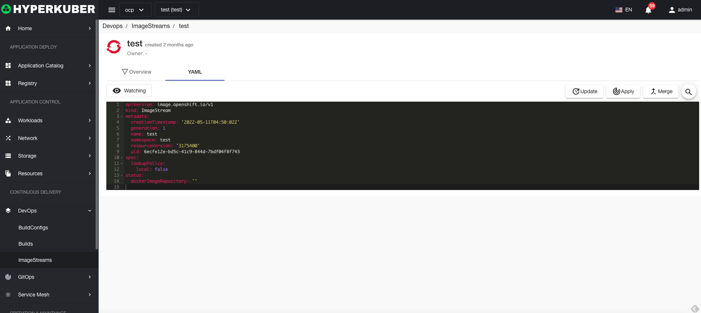

# image stream

Image streams and their associated tags provide an abstraction for referencing container images.

## Image stream operation

The following interface graphical operations are supported:

* Label
* Notes
* Yaml/Json editing

### Create
Create an image stream, click the "Create Image Stream" button, enter the Create Image Stream page, and fill in the necessary parameters

parameter
name: image stream name
Click "Create" to do so.

### Mirror Stream Details
Click the link of the image stream name to enter the details page of the image stream
Overview information

Yaml information

### delete
Select the image stream to be deleted, click the multi-select box to select, click the "Delete button", and enter "yes" in the confirmation input box to complete the deletion operation.
### refresh
Click "Refresh" to complete the refresh of the mirror stream list.