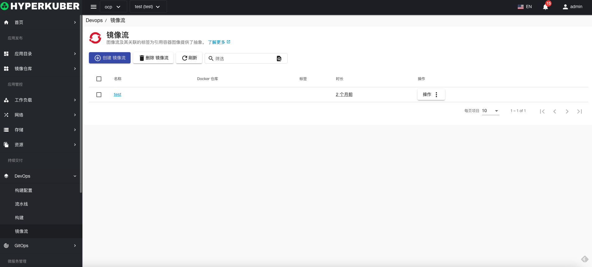
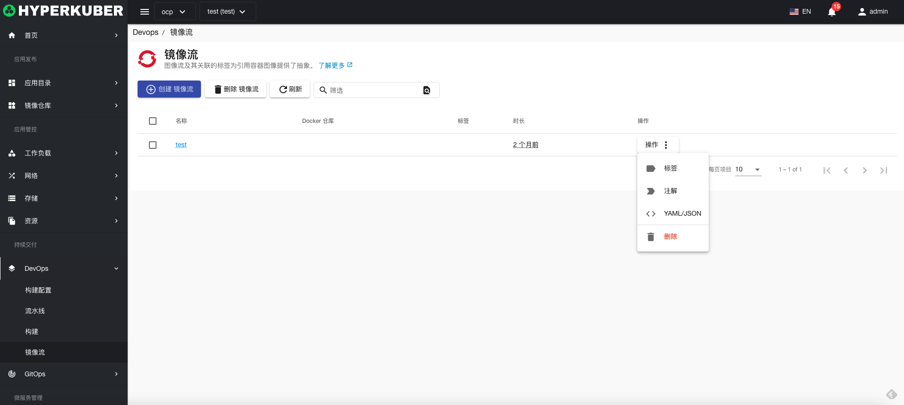
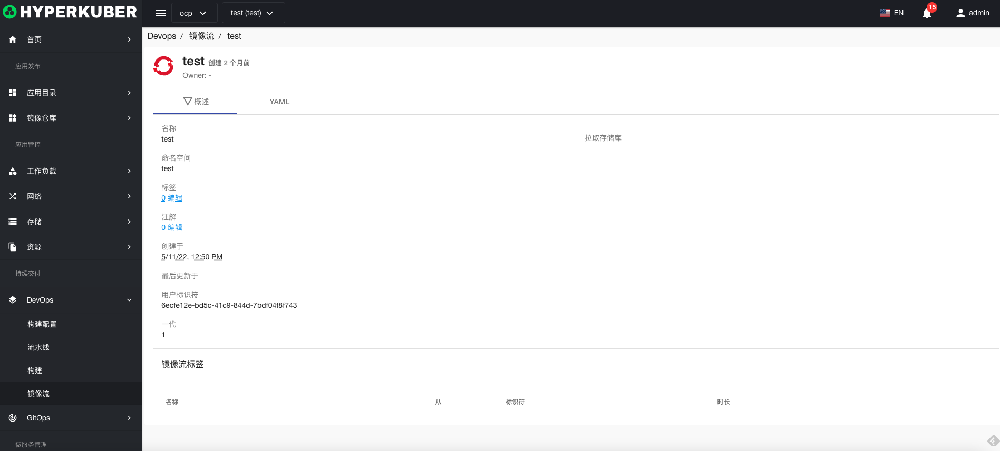
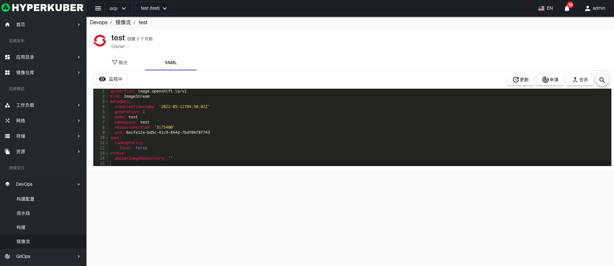

# 镜像流

图像流及其关联的标签为引用容器图像提供了抽象。

## 镜像流操作

支持以下界面图形化操作：

* 标签
* 注解
* Yaml/Json编辑

### 创建
创建镜像流，点击“创建镜像流”按钮，进入创建镜像流页面，填写必要参数

参数
名称：镜像流名称
点击“创建”即可。

### 镜像流详情
点击镜像流名称的链接，即可进入镜像流的详情页面
概览信息

Yaml信息

### 删除
选择需要删除的镜像流，点击多选框选择，点击“删除按钮”，在确定输入框输入“yes”，即可完成删除操作。
### 刷新
点击“刷新”，即可完成镜像流列表的刷新。

