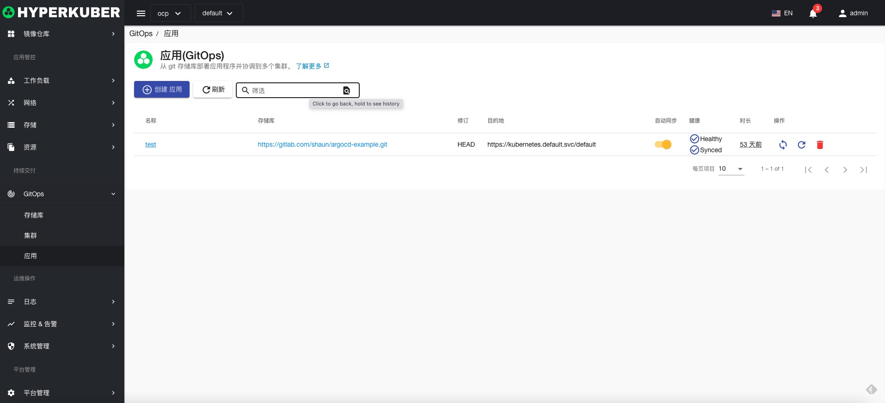
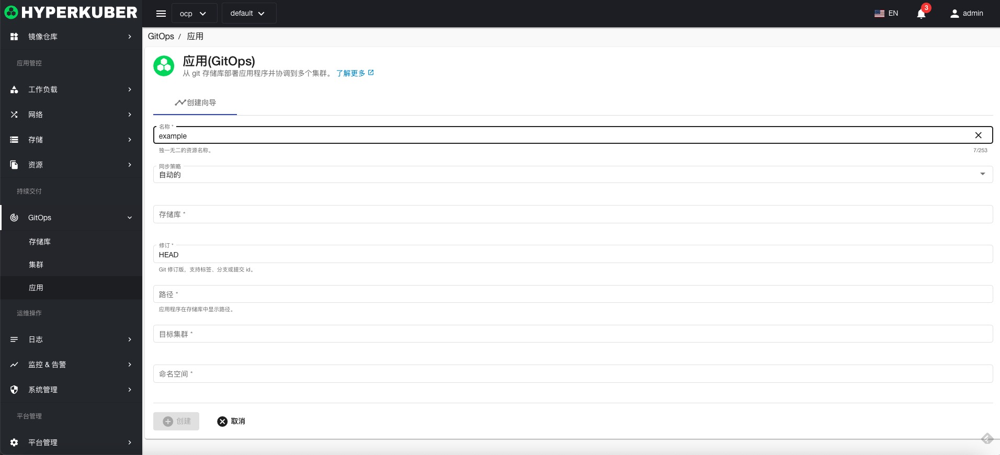
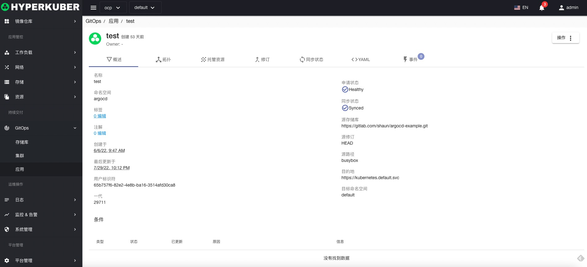
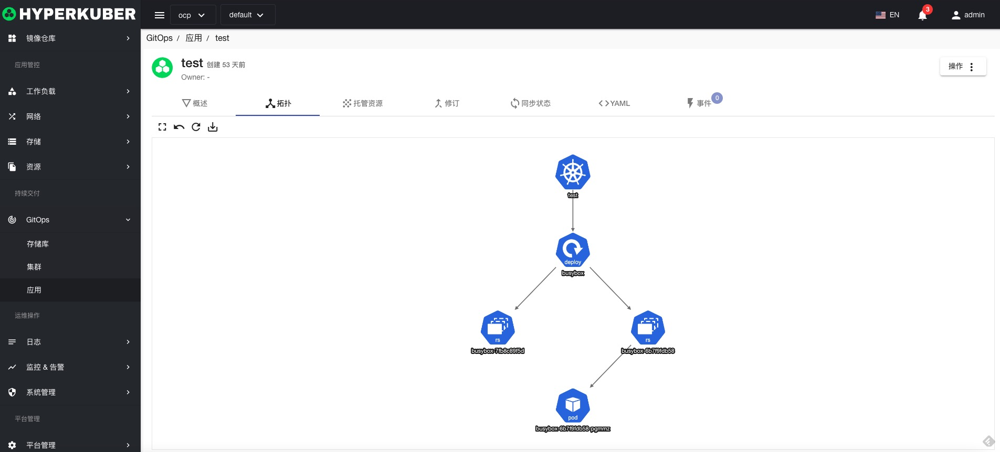
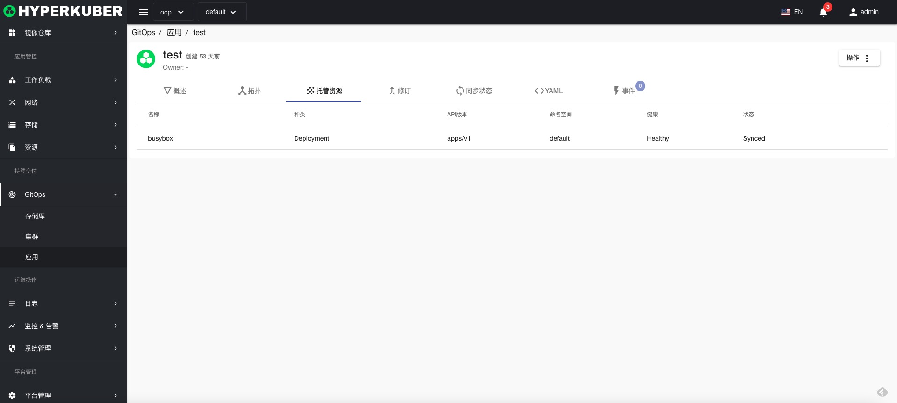
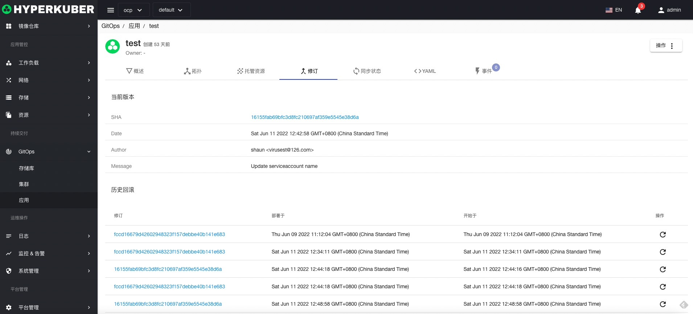
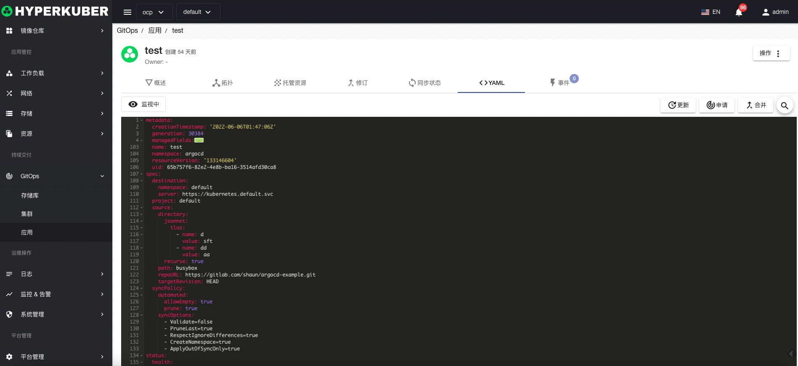
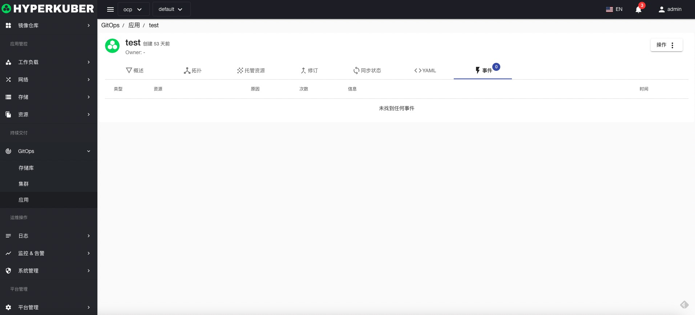

# Git应用

创建GitOps应用以及GitOps应用管理

## Git应用操作
点击左侧“GitOps”菜单，进入GitOps 应用页面进行相关操作

### 创建应用

点击“创建Git应用”按钮，进入连接Git应用创建页面，填写必要参数，保存。

参数设置：
* Git应用名称
* Git应用同步策略：
手动：需人为点击页面触发 
自动：Git有变更时自动触发
* Git应用使用的Git仓库
* Git应用使用的Git仓库的版本，分支，tag或者commitID
* Git应用使用的Git仓库路径
* 选择Git应用安装的目标集群
* 选择Git应用安装的目标集群的命名空间

### 应用详情
点击“Git应用”列表的链接，进入Git应用详情页面。

Git应用拓扑

Git应用资源

Git仓库信息

Git应用与Git仓库同步状态

Git应用Yaml信息

Yaml支持操作 
* update
* apply
* merge

Git应用事件信息

### 删除
选择需要删除的Git应用，点击多选框选择，点击“删除”按钮，在确定输入框输入“yes”，即可完成删除操作。
### 刷新
点击“刷新”，即可完成Git应用列表的刷新。