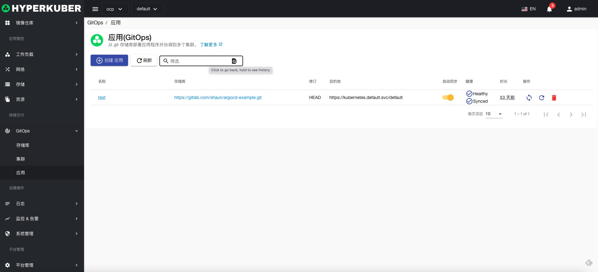
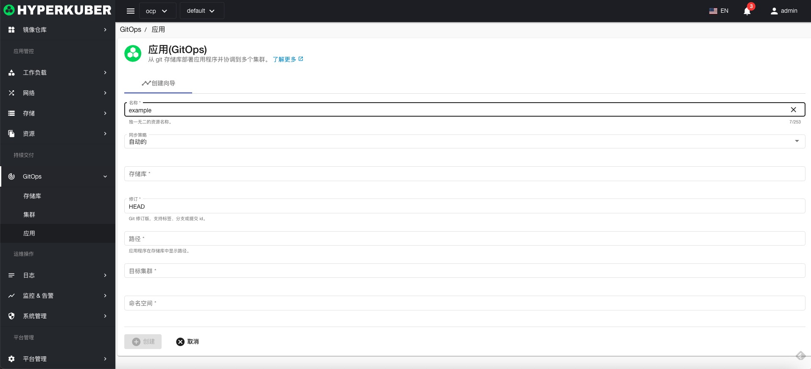
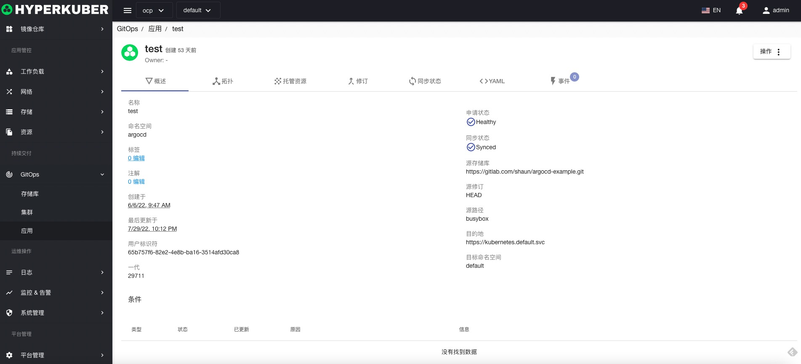
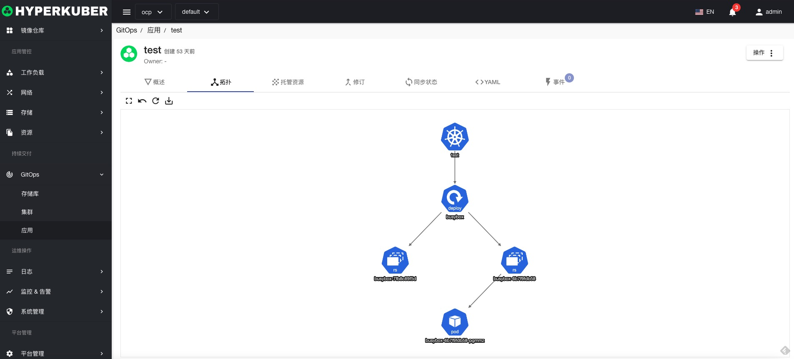
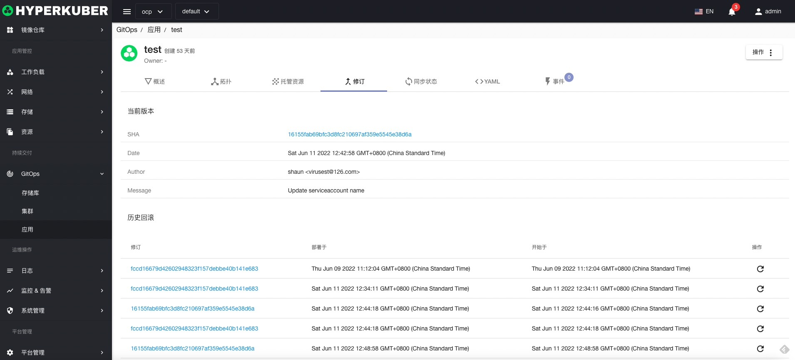
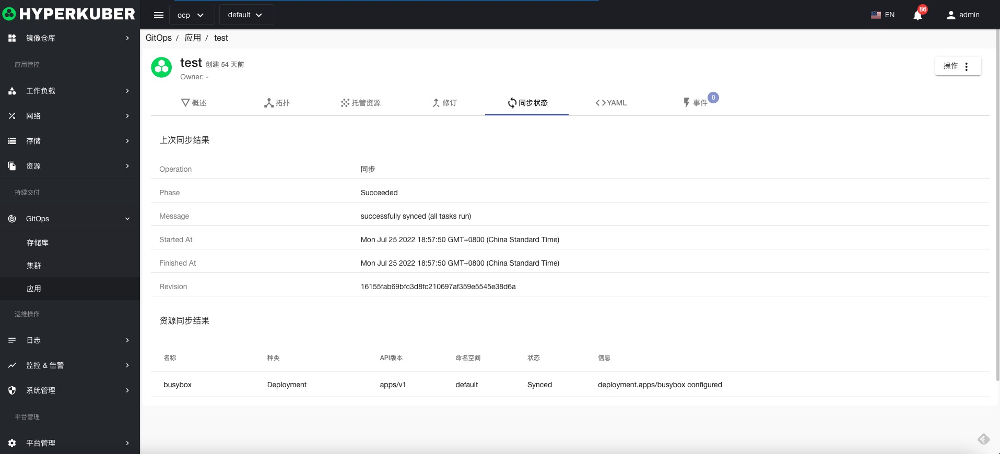
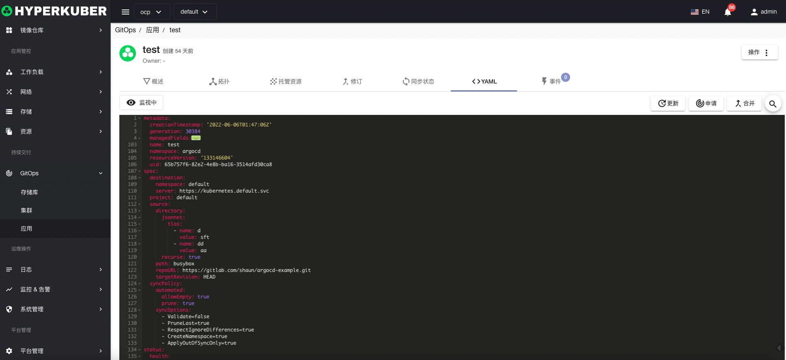
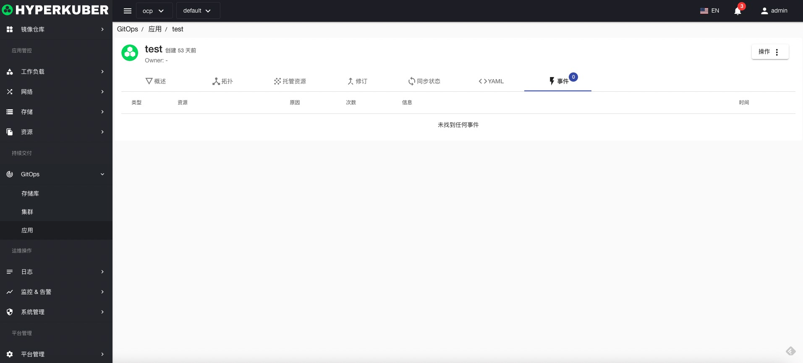

# Git application

Create GitOps applications and manage GitOps applications

## Git application operations
Click the "GitOps" menu on the left to enter the GitOps application page to perform related operations

### Create application

Click the "Create Git Application" button to enter the connection Git application creation page, fill in the necessary parameters, and save.

parameter settings:
* Git application name
* Git applies sync strategy:
Manual: need to manually click the page to trigger
Automatic: Triggered automatically when Git changes
* Git repository used by Git application
* The version, branch, tag or commitID of the Git repository used by the Git application
* The path to the Git repository used by the Git application
* Select the target cluster where the Git application is installed
* Select the namespace of the target cluster where the Git application is installed

### Application Details
Click the link in the "Git Applications" list to enter the Git application details page.

Git application topology

Git application resources

Git repository information

Git application sync state with Git repository

Git application yaml information

Yaml support operations
* update
* apply
* merge

Git application event information

### delete
Select the Git application to be deleted, click the multi-select box to select, click the "Delete" button, and enter "yes" in the confirmation input box to complete the deletion operation.
### refresh
Click "Refresh" to complete the refresh of the Git application list.