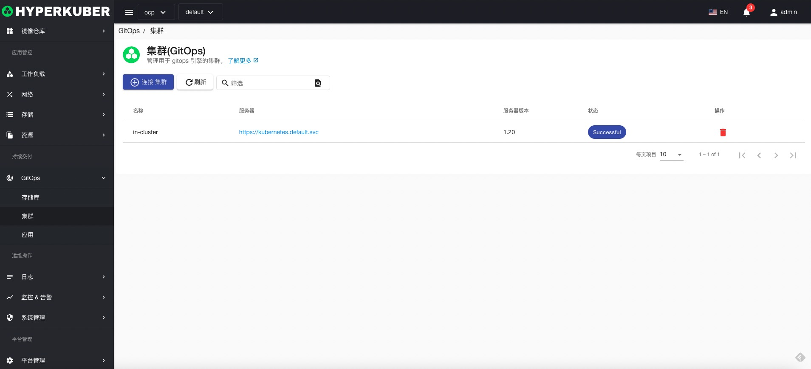
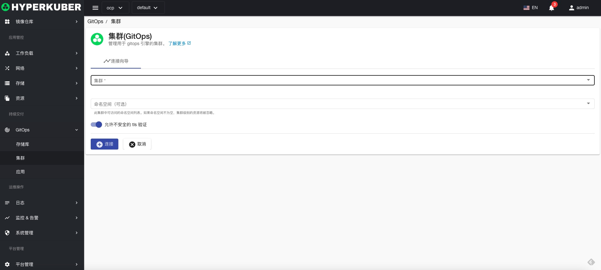

# Git集群

创建连接到Git集群，用于GitOps 应用的安装操作

## Git集群操作
点击左侧“GitOps”菜单，进入GitOps页面进行相关操作

### 连接Git集群

点击“连接Git集群”按钮，进入连接Git集群页面，填写必要参数，保存。

参数设置：
* Git集群选择，目前支持Hyperkuber平台中注册的集群，平台外集群暂不支持。
* Git集群命名空间（可选）
* 允许不安全的TLS连接（可选）

### 删除
选择需要删除的Git集群，点击多选框选择，点击“删除”按钮，在确定输入框输入“yes”，即可完成删除操作。
### 刷新
点击“刷新”，即可完成Git集群列表的刷新。