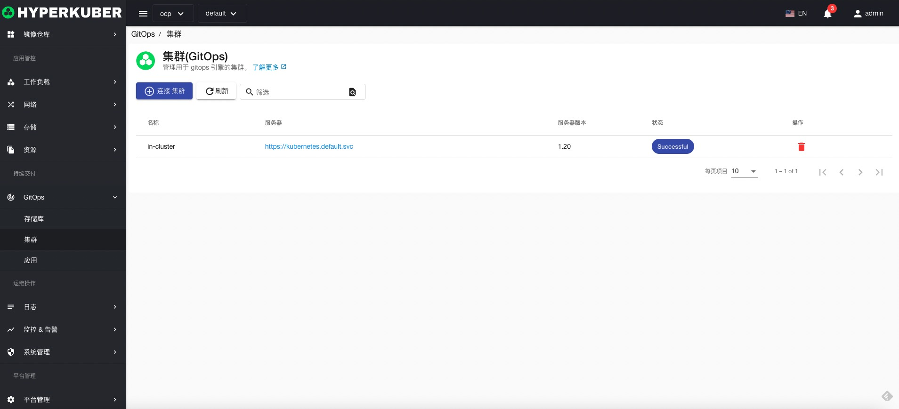
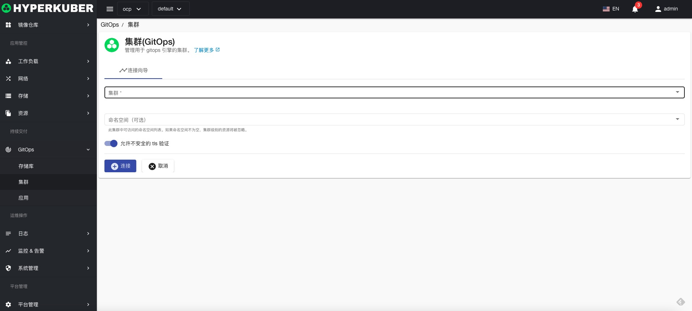

# Git cluster

Create a connection to a Git cluster for installation of GitOps applications

## Git cluster operations
Click the "GitOps" menu on the left to enter the GitOps page to perform related operations

### Connect to Git cluster

Click the "Connect Git Cluster" button to enter the Connect Git Cluster page, fill in the necessary parameters, and save.

parameter settings:
* Git cluster selection, currently supports the cluster registered in the Hyperkuber platform, and does not support the cluster outside the platform.
* Git cluster namespace (optional)
* Allow insecure TLS connections (optional)

### delete
Select the Git cluster to be deleted, click the multi-select box to select, click the "Delete" button, and enter "yes" in the confirmation input box to complete the deletion operation.
### refresh
Click "Refresh" to complete the refresh of the Git cluster list.