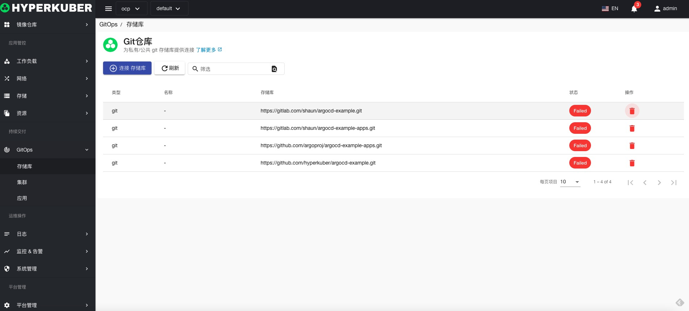
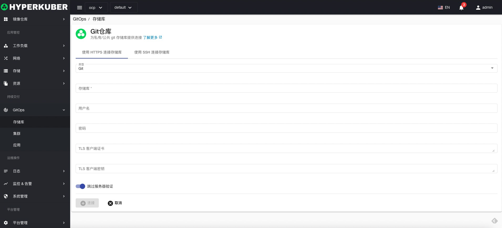
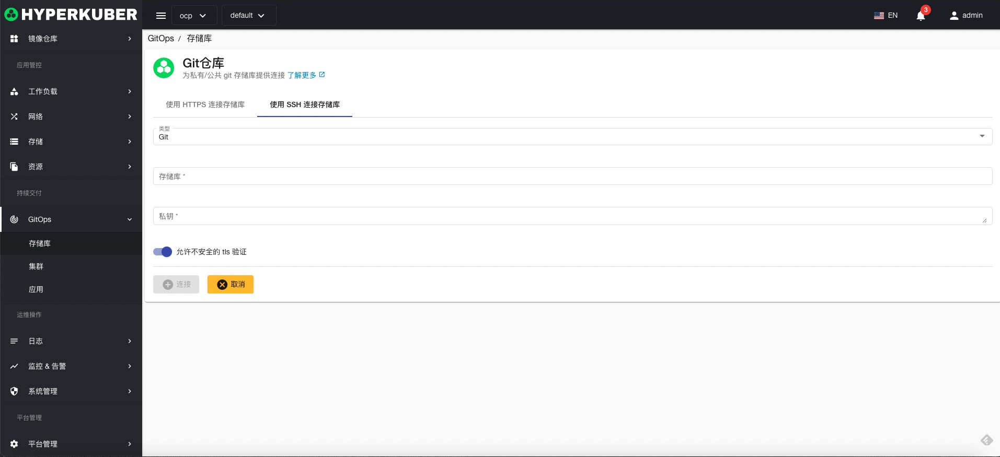

# Git repository

Create connections to Git repositories for GitOps operations

## Git repository operations
Click the "GitOps" menu on the left to enter the GitOps page to perform related operations

### Connect to Git repository

Click the "Connect Git Warehouse" button to enter the Connect Git Warehouse page, fill in the necessary parameters, and save.
#### HTTP connections

parameter settings:
* Git repository URL
* Git repository login username
* Git repository login password
* Git repository client certificate (optional)
* Git repository client key (optional)

#### SSH connection

parameter settings:
* Git repository URL
* Git repository key Key

### delete
Select the Git repository to be deleted, click the multi-select box to select, click the "Delete" button, and enter "yes" in the confirmation input box to complete the deletion operation.
### refresh
Click "Refresh" to complete the refresh of the Git repository list.