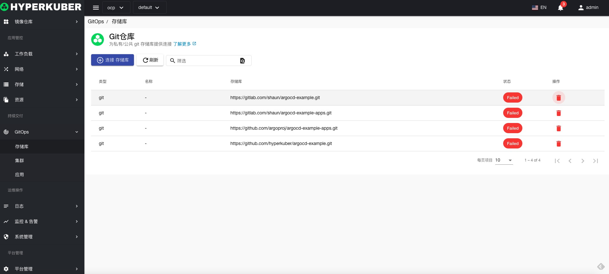
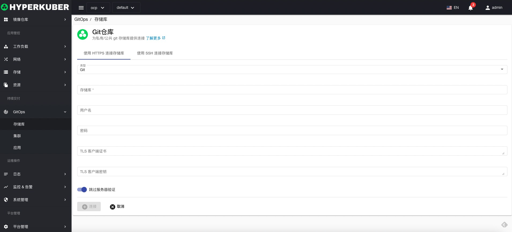
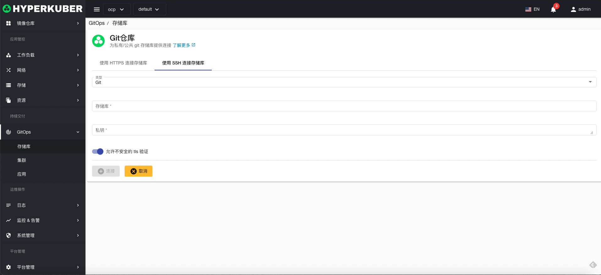

# Git仓库

创建连接到Git仓库，用于GitOps操作

## Git仓库操作
点击左侧“GitOps”菜单，进入GitOps页面进行相关操作

### 连接Git仓库

点击“连接Git仓库”按钮，进入连接Git仓库页面，填写必要参数，保存。
#### HTTP连接

参数设置：
* Git仓库URL
* Git仓库登陆用户名
* Git仓库登陆密码
* Git仓库客户端证书（选填）
* Git仓库客户端密钥（选填）

#### SSH连接

参数设置：
* Git仓库URL
* Git仓库密钥Key

### 删除
选择需要删除的Git仓库，点击多选框选择，点击“删除”按钮，在确定输入框输入“yes”，即可完成删除操作。
### 刷新
点击“刷新”，即可完成Git仓库列表的刷新。