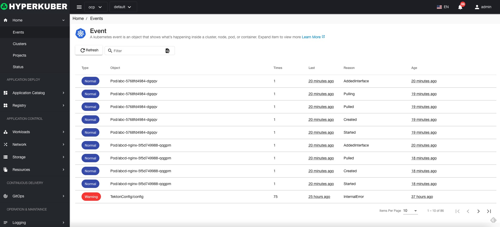
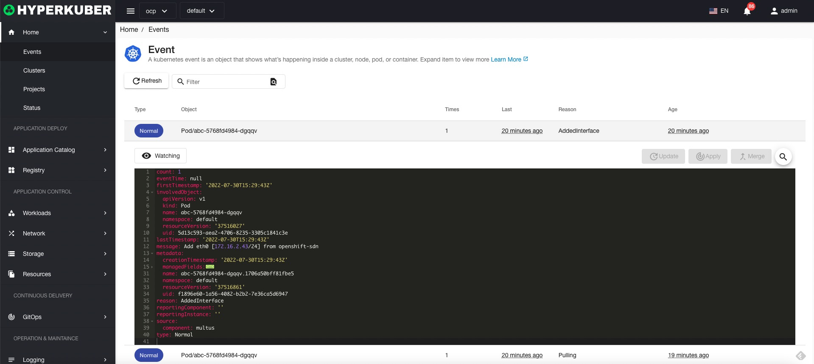

# event

The event can display the life cycle of the resources in the current namespace in the cluster, providing a data source for the objectivity of the service.

## event action

### search
event supports metadata.name keyword for search
### Event Details
Click the link of the event name to display the event details

### refresh
Click "Refresh" to complete the refresh of the event list.