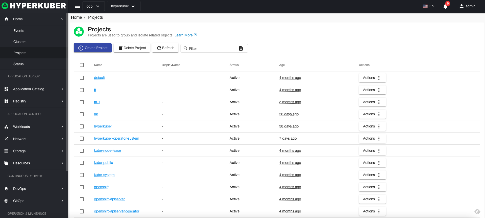
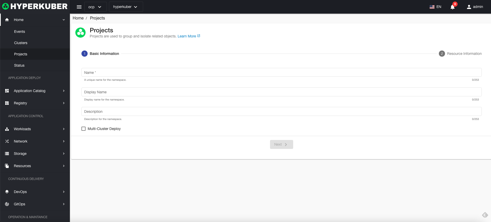
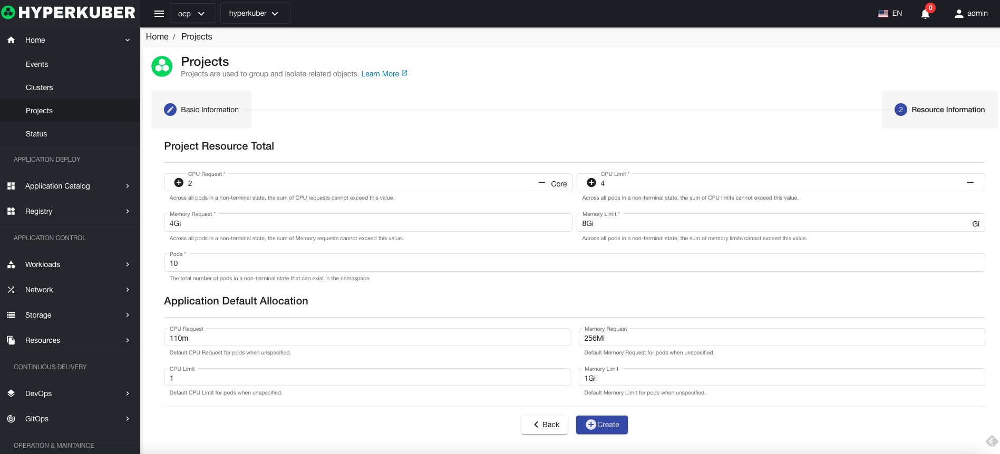
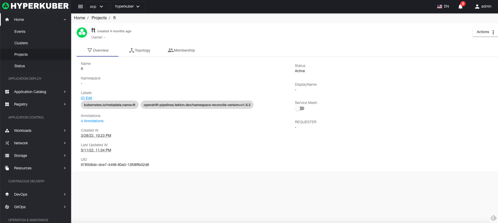
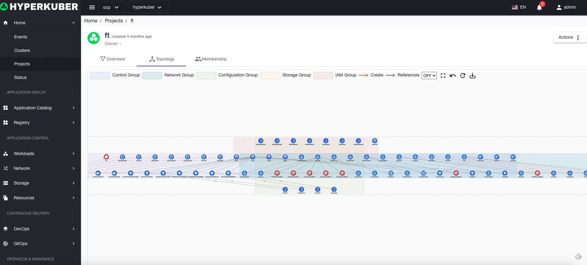
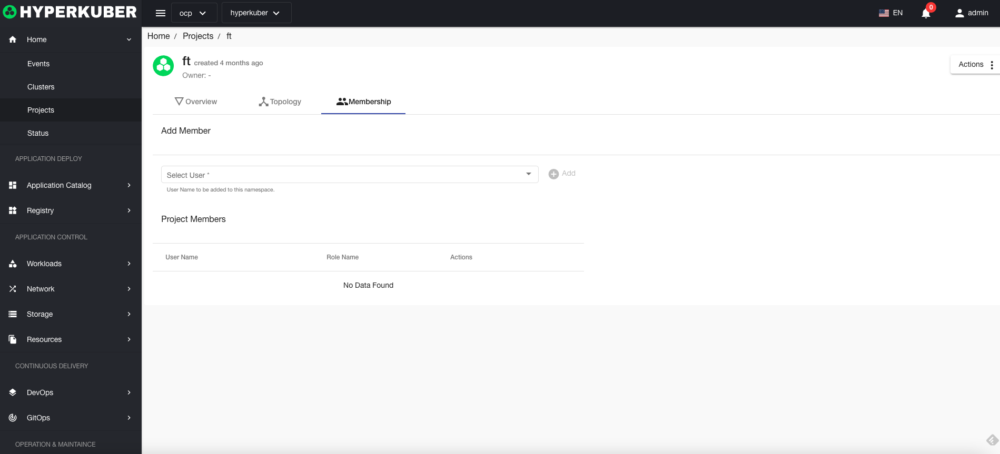

# project

## project
Projects are used to group and isolate related objects

## project operation

### Create
Click the "Create Project" button to enter the Create Project page, fill in the necessary parameters, and save.

Parameter Description:
Name: Unique identifier in the cluster
Display Name: The display name of the item
Description: Description of the item
Multi-cluster selection: Select the cluster to which the project needs to be created

Total project resource limit:
* CPU allocation and limits
* Memory allocation and limits
* Pod number limit

Application default assignment:
* CPU allocation and limits
* Memory allocation and limits

### Details
Click the "Project" name link to enter the project details page.

Project resource topology diagram, including the main Workload resource display and their interrelationships

Project user resource display

### delete
Select the item to be deleted, click the multi-select box to select, click the "Delete" button, and enter "yes" in the confirmation input box to complete the deletion operation.
### refresh
Click "Refresh" to complete the refresh of the item list.