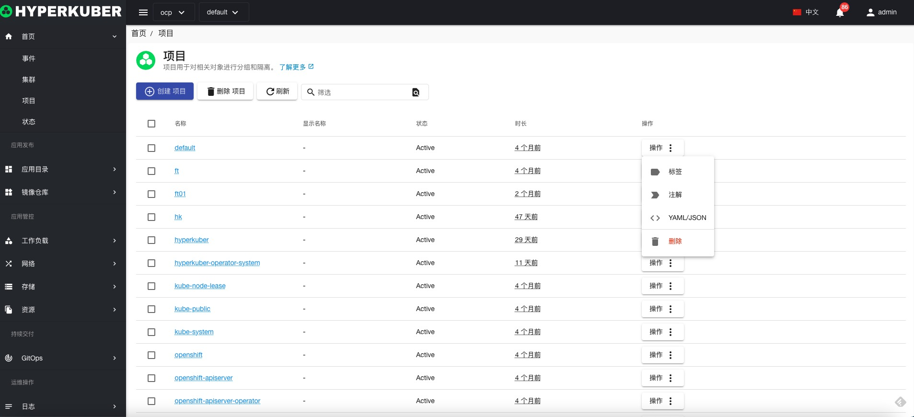
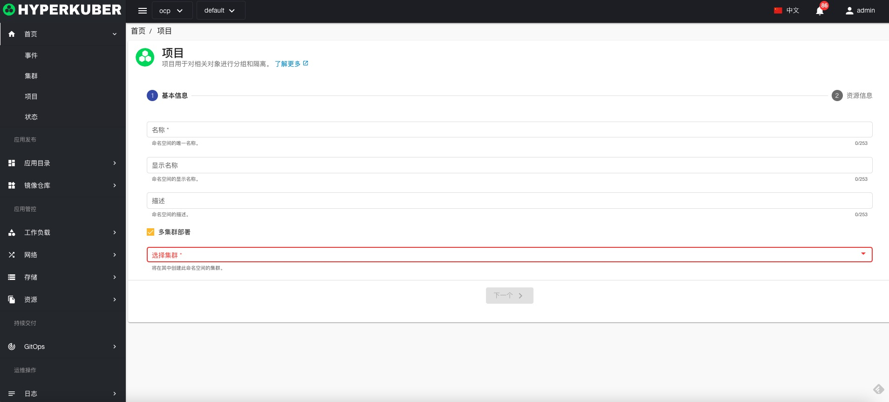
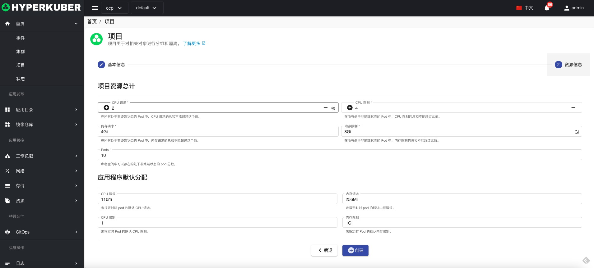
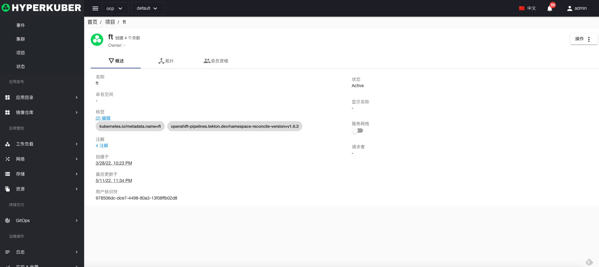
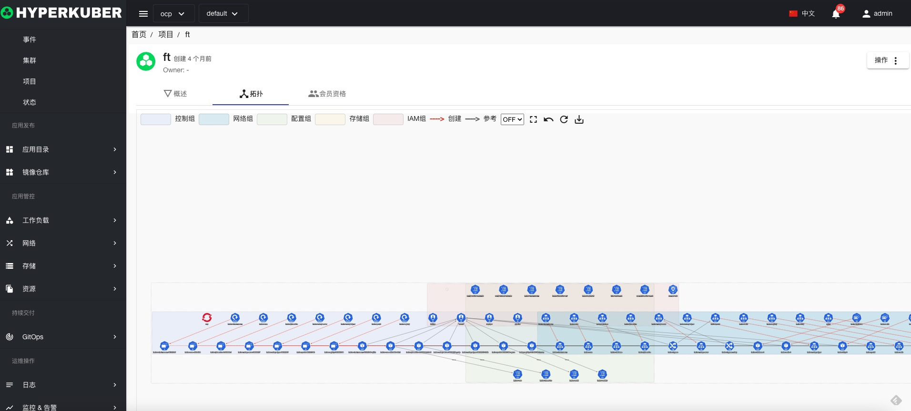
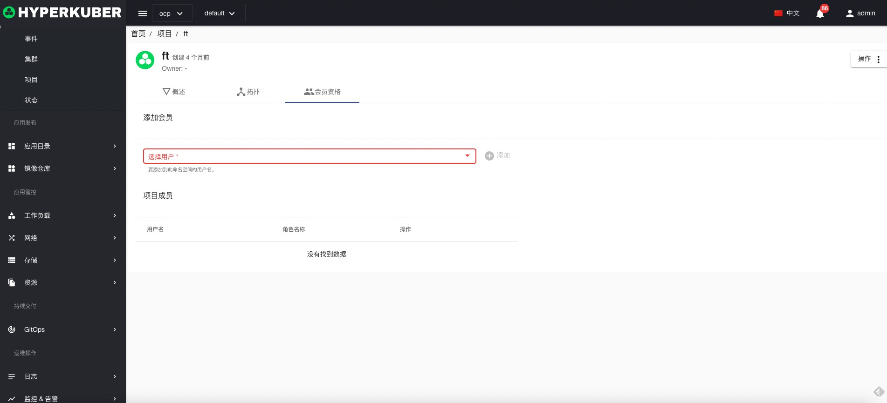

# 项目

## 项目
项目用于对相关对象进行分组和隔离

## 项目操作

### 创建
点击“创建项目”按钮，进入创建项目页面，填写必要参数，保存。

参数说明：
名称：集群中唯一标识
显示名称： 项目的显示名称
描述：项目的描述信息
多集群选择： 选择项目需要创建到的集群

项目总资源限制：
* CPU 分配以及限制
* 内存 分配以及限制
* Pod个数限制

应用程序默认分配：
* CPU 分配以及限制
* 内存 分配以及限制

### 详情
点击“项目”名称链接，进入项目详情页面。

项目资源拓扑图，包括主要的Workload资源显示以及其相互关系

项目用户资源显示

### 删除
选择需要删除的项目，点击多选框选择，点击“删除”按钮，在确定输入框输入“yes”，即可完成删除操作。
### 刷新
点击“刷新”，即可完成项目列表的刷新。