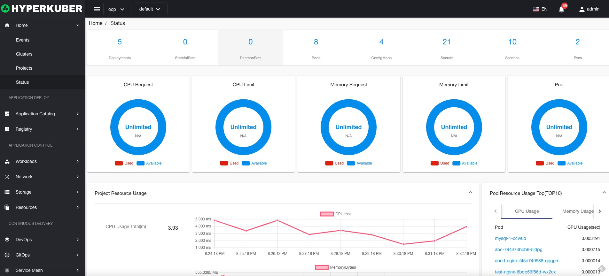

# state

## project status

Click "Status" on the left menu to display the status of the selected item

Project status information contains
* Project Workload resource statistics
* Project resource limits (including CPU allocation and limits, memory allocation and limits, and the number of Pods)
* Project monitoring information (CPU, memory, disk usage statistics, network upstream/downstream traffic)
* Project Pod resource usage Top (CPU, memory, disk usage)