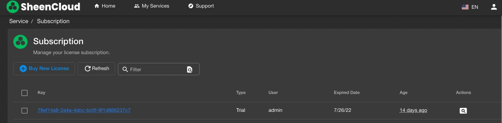
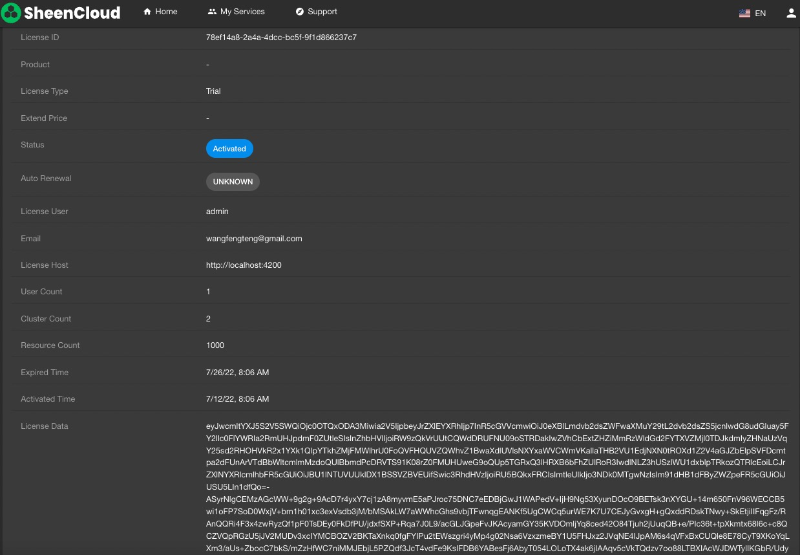

# Hyperkuber License license management

Hyperkuber's cluster management, user management and resource management are controlled by the license system. Hyperkuber users can register users through [sheencloud](https://account.sheencloud.com/sessions/signin), and then apply for or purchase a license.

## registered user
**Way 1:**
Open [sheencloud](https://account.sheencloud.com/sessions/signin), fill in the user name, and complete the registration with the user email.

*Username: The unique identifier of the user
*User mailbox: used to receive email subscriptions and email notifications from Sheencloud

**Way 2:**
Open the Ingress address of the huperkuber web service. The default address is: console.hyperkuber.io. Use the default username/password to log in: admin/hyperkuber@1314. After successful login, the License registration page is displayed, as shown in the following figure:

Fill in the username and email to complete the registration.

## Buy
Hyperkuber's license can only be purchased through SheenCloud's official website, the purchase link [License](https://account.sheencloud.com/service/subscriptions), and purchase related products according to different user needs. After payment is completed, users can subscribe The purchased license can be found on the page.

Key (LicenseID): Used to activate Hyperkuber related products online.

License Data: Click LicenseID to enter the license details page, and you can view the detailed encrypted data of LicenseData. LicenseData is used to activate Hyperkuber related products offline.

## activate
**Method 1: Online activation**
Open the Ingress address of the Hyperkuber web service, log in with the default account and password, and jump to the License activation page after successful login

Note: The environment in which the Hyperkuber service is deployed needs to be able to access the SheenCloud official website, activate

**Method 2: Offline activation**
Open the Ingress address of the Hyperkuber web service, log in with the default account and password, and jump to the License activation page after successful login

## Apply for a trial
Users can apply for a 14-day free license for free. The license includes the registration of 1 cluster, 1 user, and a resource limit of 1000.
The application method is the same as the **method 2** page for registered users. Open the Ingress address of the huperkuber web service. After the user logs in successfully, the license registration page will be displayed. Enter the user name and the user email address to apply for a free 14-day trial license.