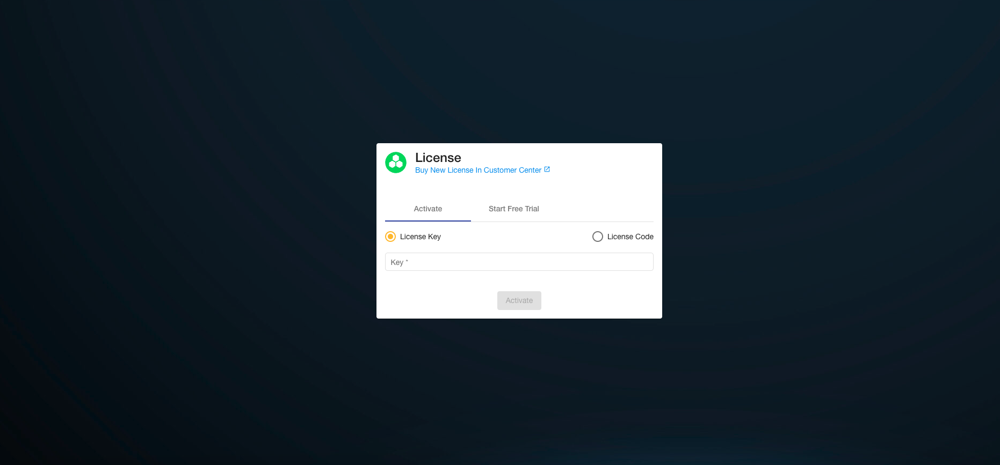
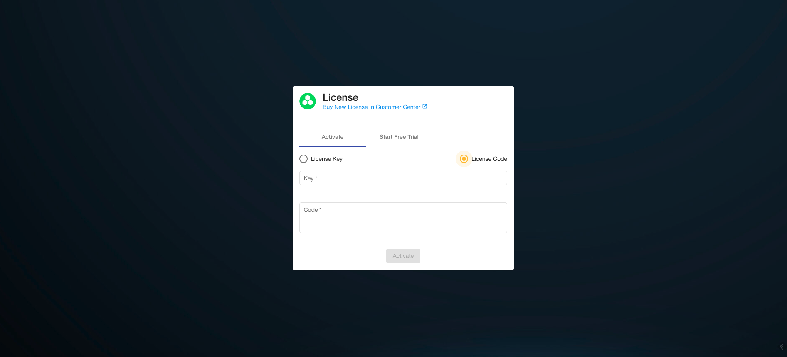

# Hyperkuber License license management

Hyperkuber's cluster management, user management and resource management are controlled by the license system. Hyperkuber users can register users through [sheencloud](https://account.sheencloud.com/sessions/signin), and then apply for or purchase a license.

## Buy
Hyperkuber's license can only be purchased through SheenCloud's official website, the purchase link [License](https://account.sheencloud.com/service/subscriptions), and purchase related products according to different user needs. After payment is completed, users can subscribe The purchased license can be found on the page.

Key (LicenseID): Used to activate Hyperkuber related products online.

License Data: Click LicenseID to enter the license details page, and you can view the detailed encrypted data of LicenseData. LicenseData is used to activate Hyperkuber related products offline.

## activate
**Method 1: Online activation**
Open the Ingress address of the Hyperkuber web service, log in with the default account and password, and jump to the License activation page after successful login

Note: The environment in which the Hyperkuber service is deployed needs to be able to access the SheenCloud official website, activate

**Method 2: Offline activation**
Open the Ingress address of the Hyperkuber web service, log in with the default account and password, and jump to the License activation page after successful login

