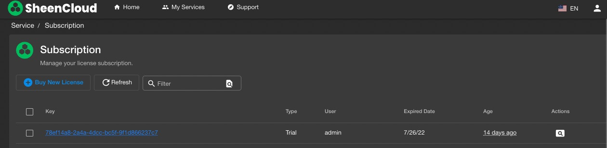
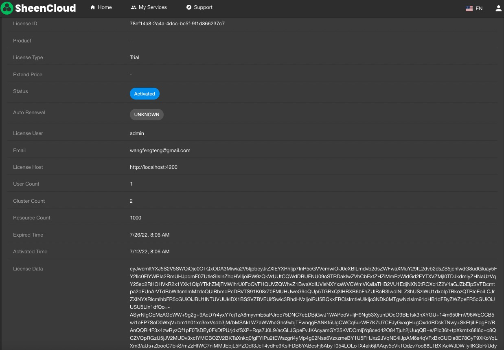
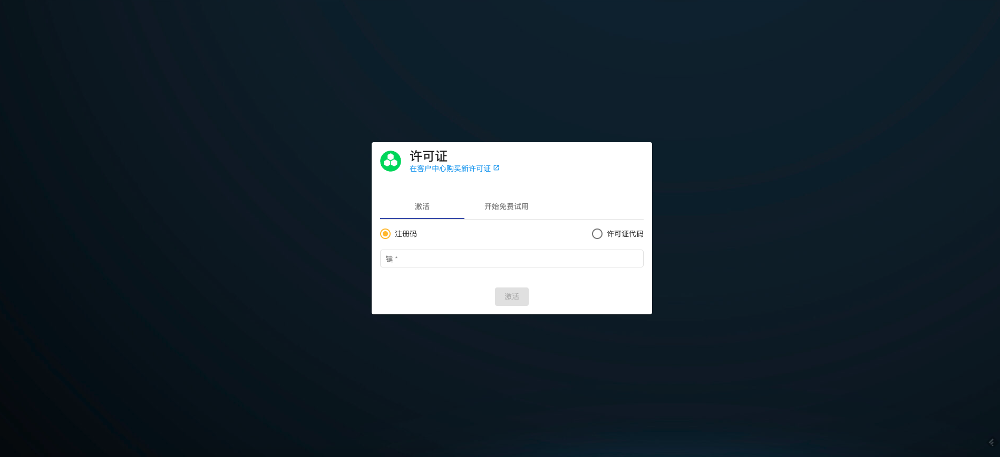
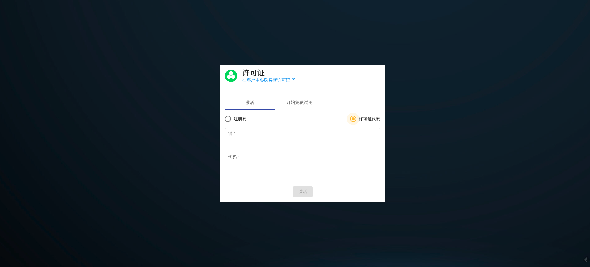

# Hyperkuber License许可管理

Hyperkuber的集群管理，用户管理以及资源管理通过License系统控制，Hyperkuber的用户可以通过[sheencloud](https://account.sheencloud.com/sessions/signin)注册用户，后申请或者购买License。

## 购买订阅
Hyperkuber的License只能通过SheenCloud的官方网站购买，购买链接[License](https://account.sheencloud.com/service/subscriptions),根据不同的用户需求购买相关产品，付款完成后，用户可以在订阅页面查询到已购买的License。

Key（LicenseID）： 用于在线激活Hyperkuber相关产品。

License Data：点击LicenseID进入License的详情页面，可以查看到LicenseData的详细加密数据，LicenseData用于离线激活Hyperkuber相关产品

## 激活
**方式1:在线激活**
打开Hyperkuber web服务的Ingress地址,使用默认账号密码登陆，登陆成功后跳转License激活页面

注：部署Hyperkuber服务的环境需要能访问SheenCloud官方网站，激活

**方式2:离线激活**
打开Hyperkuber web服务的Ingress地址,使用默认账号密码登陆，登陆成功后跳转License激活页面

