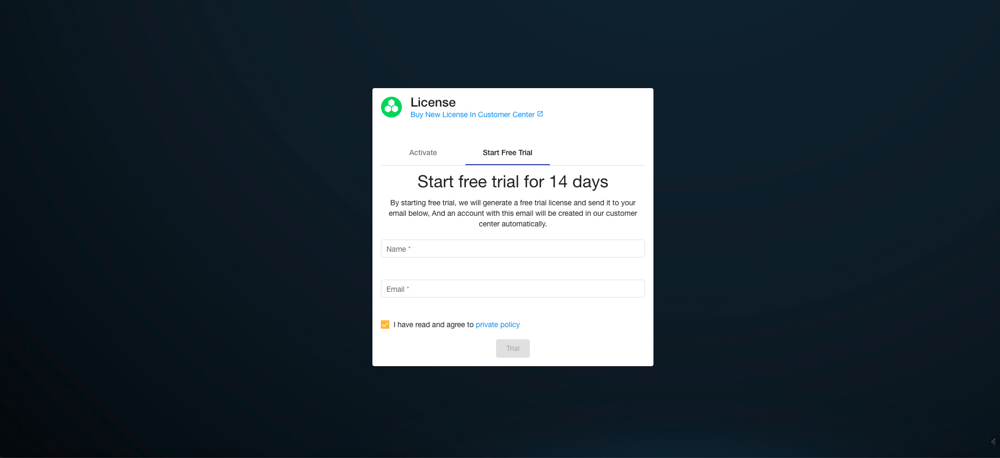

# Hyperkuber License license management

Hyperkuber's cluster management, user management and resource management are controlled by the license system. Hyperkuber users can register users through [sheencloud](https://account.sheencloud.com/sessions/signin), and then apply for or purchase a license.

## registered user
**Way 1:**
Open [sheencloud](https://account.sheencloud.com/sessions/signin), fill in the user name, and complete the registration with the user email.

*Username: The unique identifier of the user
*User mailbox: used to receive email subscriptions and email notifications from Sheencloud

**Way 2:**
Open the Ingress address of the huperkuber web service. The default address is: console.hyperkuber.io. Use the default username/password to log in: admin/hyperkuber@1314. After successful login, the License registration page is displayed, as shown in the following figure:

Fill in the username and email to complete the registration.

## Apply for a trial
Users can apply for a 14-day free license for free. The license includes the registration of 1 cluster, 1 user, and a resource limit of 1000.
The application method is the same as the **method 2** page for registered users. Open the Ingress address of the huperkuber web service. After the user logs in successfully, the license registration page will be displayed. Enter the user name and the user email address to apply for a free 14-day trial license.