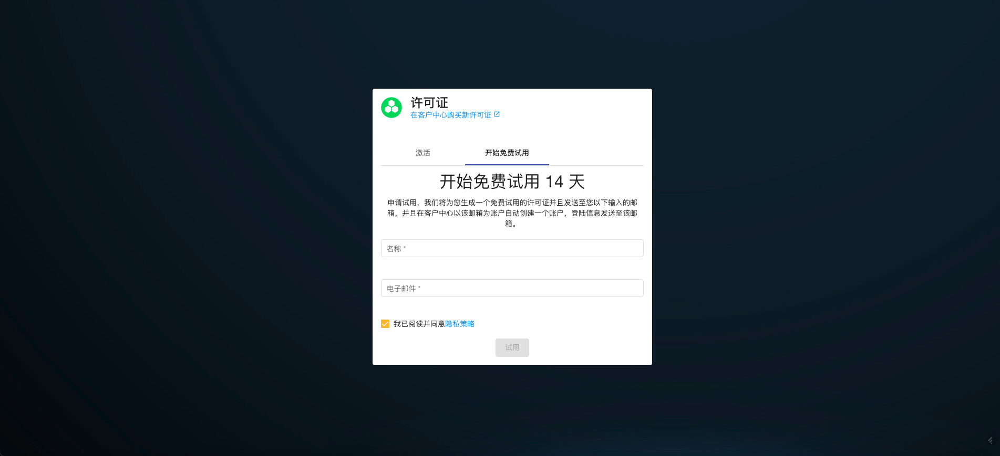

# Hyperkuber License许可管理

Hyperkuber的集群管理，用户管理以及资源管理通过License系统控制，Hyperkuber的用户可以通过[sheencloud](https://account.sheencloud.com/sessions/signin)注册用户，后申请或者购买License。

## 注册用户
**方式1:**
打开[sheencloud](https://account.sheencloud.com/sessions/signin)，填写用户名，用户邮箱完成注册。

*用户名：用户的唯一标识
*用户邮箱：用于接受Sheencloud的邮件订阅以及邮件通知

**方式2:**
打开huperkuber web服务的Ingress地址，默认地址是：console.hyperkuber.io,使用默认用户名/密码登陆： admin/hyperkuber@1314，登陆成功后，显示License注册页面，如下图所示：

填写用户名，用户邮箱完成注册。

## 申请试用
用户可以免费申请为期14天的免费License，License中包含注册1个集群，1个用户，资源限制1000。
申请方式如注册用户的**方式2**页面相同，打开huperkuber web服务的Ingress地址，用户登陆成功后，显示License注册页面，输入用户名，用户邮箱即可申请免费14天的试用License

