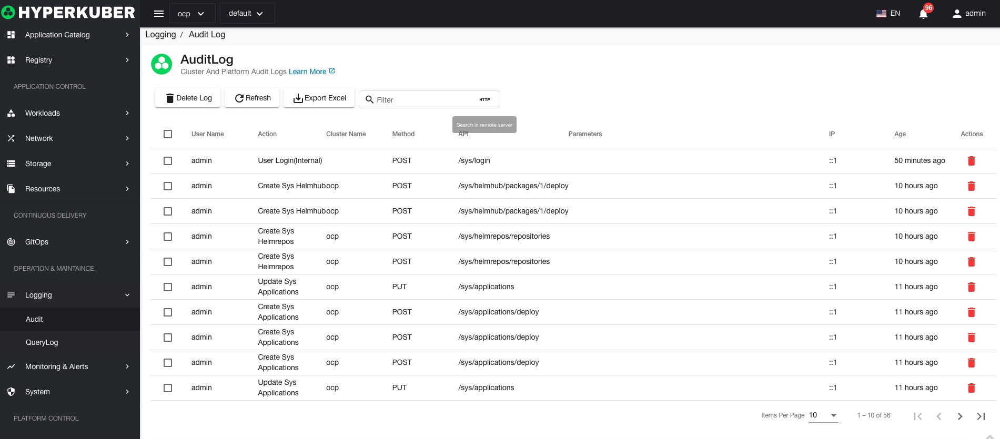

# log

## Audit log
The audit log records the operation records of users logging in to Hyperkuber products.

### Audit log operations

#### delete
Select the installed log to be deleted, click the multi-select box to select, click the "Delete button", and enter "yes" in the confirmation input box to complete the deletion operation.

#### refresh
Click "Refresh" to refresh the audit log list.

#### Export Excel
Click "Export to Excel" to complete the export of the current audit log list to Excel