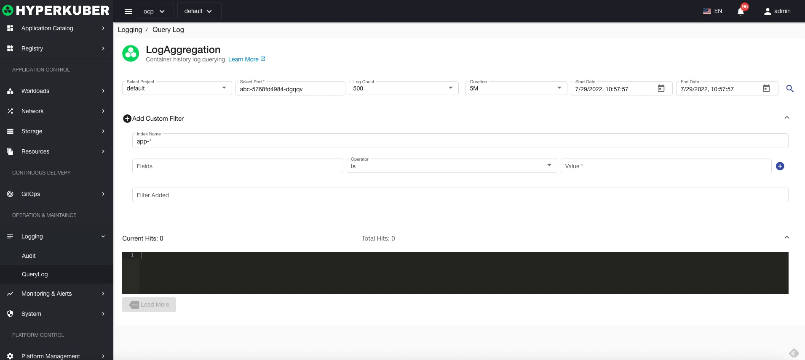

# log

## query log
Support users to query logs in ElasticSearch. The URL of Elastic Search is configured in the parameter configuration in the registered cluster.

Query parameter description:

* Namespaces
* Pod name
* Maximum number of logs
* log interval
* Log query start time
* Deadline for log query

**Filter**
* index name
* For the expression of Elastic Search, refer to the official document of Elastic Search: https://www.elastic.co/guide/en/elasticsearch/reference/current/query-filter-context.html