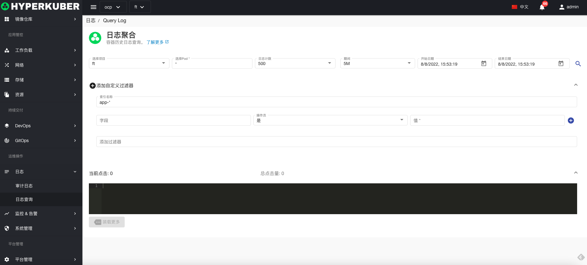

# 日志

## 查询日志
支持用户查询ElasticSearch中的日志。Elastic Search的URL配置在注册集群中的参数配置。

查询参数说明：

* 命名空间
* Pod名称
* 最大日志条数
* 日志时间间隔
* 日志查询开始时间
* 日志查询截止时间

**Filter**
* 索引名称
* Elastic Search的表达式，参照Elastic Search官方文档 ：https://www.elastic.co/guide/en/elasticsearch/reference/current/query-filter-context.html

