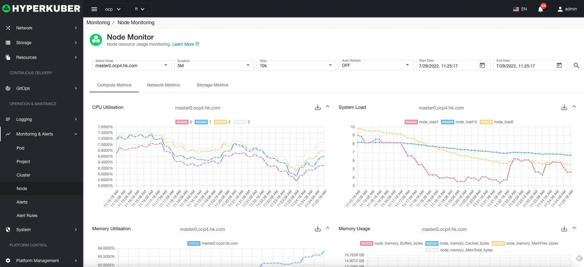
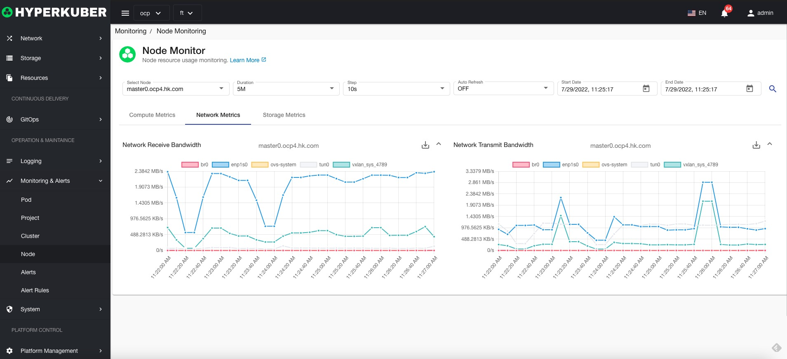
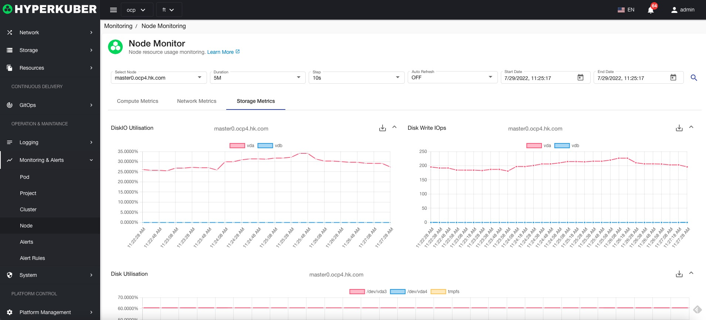

# Node monitoring

## Node monitoring details
Query parameters:
* Node node name
* Monitoring time interval
* Monitoring data time interval
* Auto Refresh
* Monitoring data start time
* Monitoring data deadline

### Computing resource monitoring
Computing resources support monitoring items
* CPU usage (number of cpu cores)
* System load Load1 Load5 Load15
* memory usage
* Memory usage (Cached Buffers Free total)

### Computational network monitoring
Network resource support monitoring items
* Network upstream/downstream bandwidth

### Computational storage monitoring
Storage resource support monitoring items

* File system disk IO
* File system write IOPS
* File system usage
