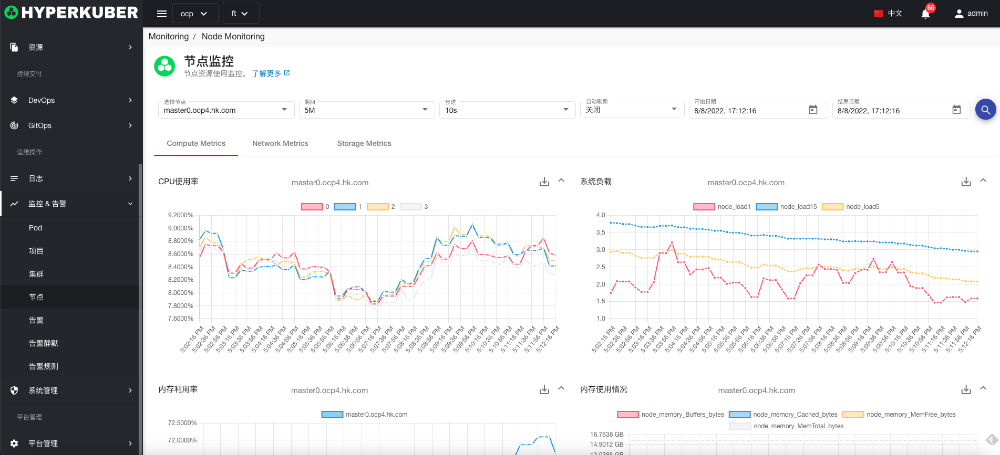
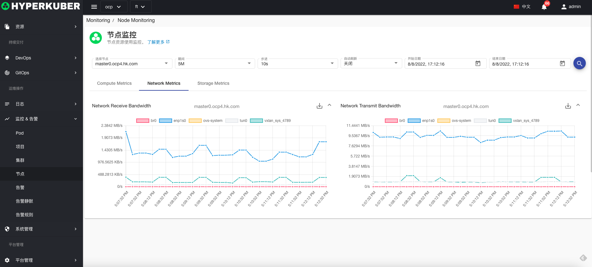
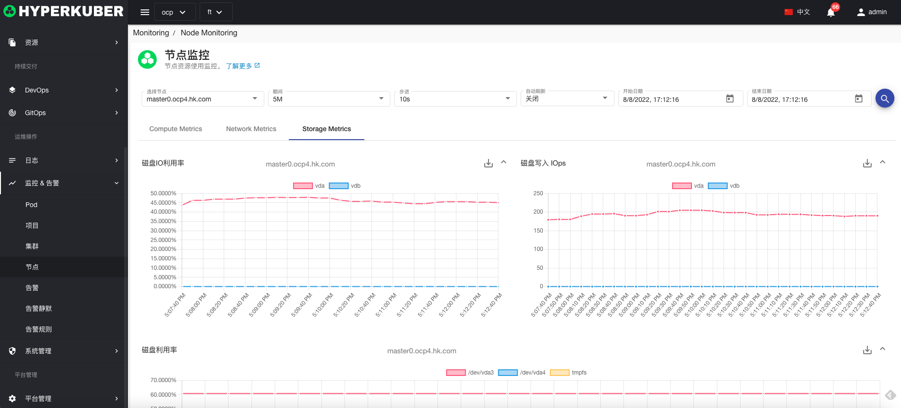

# Node监控

## Node监控详情
查询参数：
* Node节点名称
* 监控时间间隔
* 监控数据时间间隔
* 自动刷新
* 监控数据开始时间
* 监控数据截止时间

### 计算资源监控
计算资源支持监控项
* CPU使用率（cpu核心数）
* 系统负载 Load1 Load5 Load15
* 内存使用率
* 内存使用量（Cached Buffers Free total）

### 计算网络监控
网络资源支持监控项
* 网络上行/下行带宽

### 计算存储监控
存储资源支持监控项

* 文件系统磁盘IO
* 文件系统写IOPS
* 文件系统使用率
