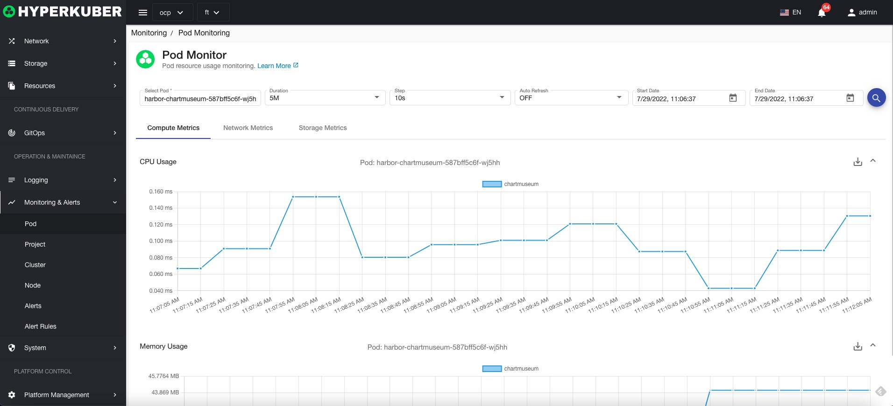
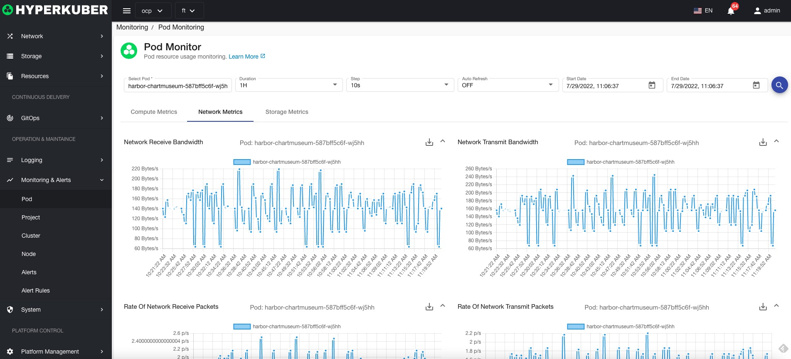
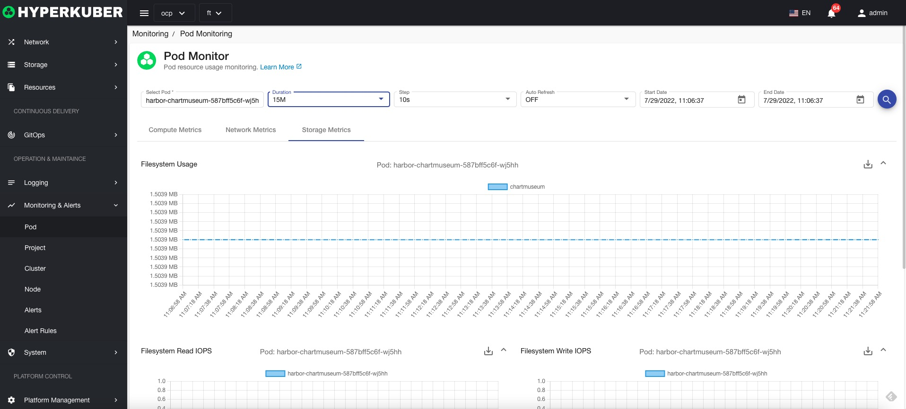

# Pod monitoring

## pod monitoring details
Query parameters:
* Pod name
* Monitoring time interval
* Monitoring data time interval
* Auto Refresh
* Monitoring data start time
* Monitoring data deadline

### Computing resource monitoring
Computing resources support monitoring items
* CPU usage
* memory usage

### Computational network monitoring
Network resource support monitoring items
* Network upstream/downstream bandwidth
* Network uplink/downlink rate

### Computational storage monitoring
Storage resource support monitoring items
* File system usage
* File system read/write IOPS
* File system read/write throughput
