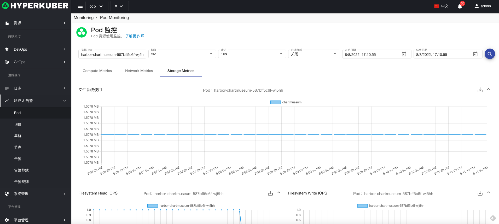

# Pod监控

## pod监控详情
查询参数：
* Pod名称
* 监控时间间隔
* 监控数据时间间隔
* 自动刷新
* 监控数据开始时间
* 监控数据截止时间

### 计算资源监控
计算资源支持监控项
* CPU使用量
* 内存使用量

### 计算网络监控
网络资源支持监控项
* 网络上行/下行带宽
* 网络上行/下行速率

### 计算存储监控
存储资源支持监控项
* 文件系统使用量
* 文件系统读/写IOPS
* 文件系统读/写吞吐量
