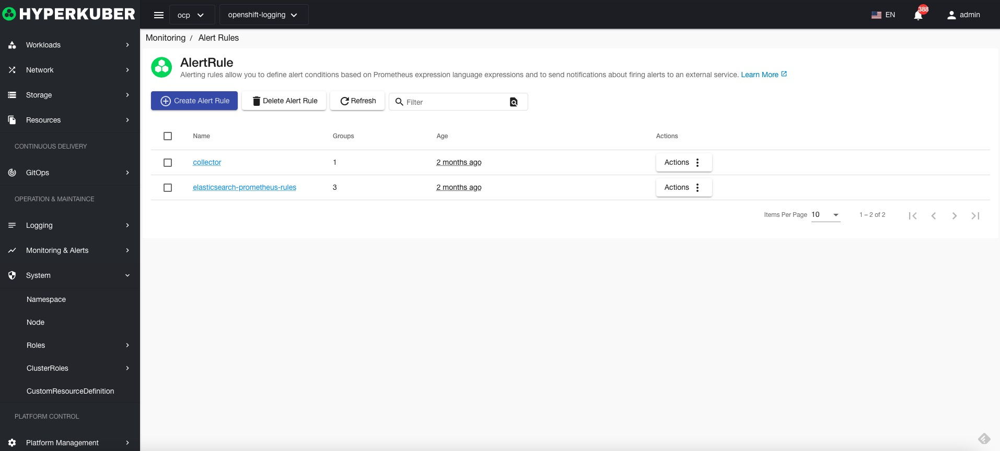
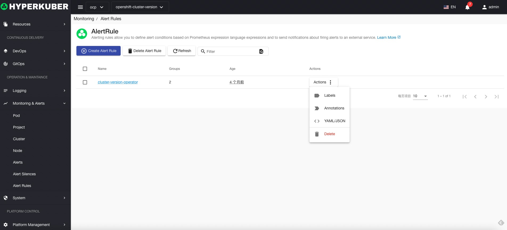
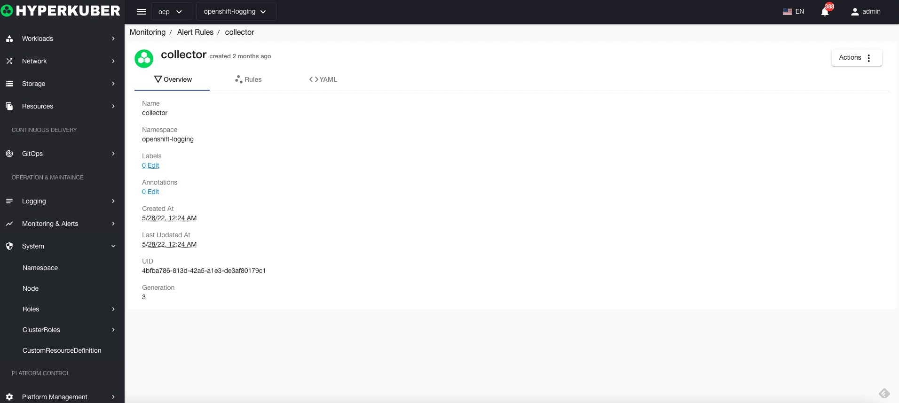
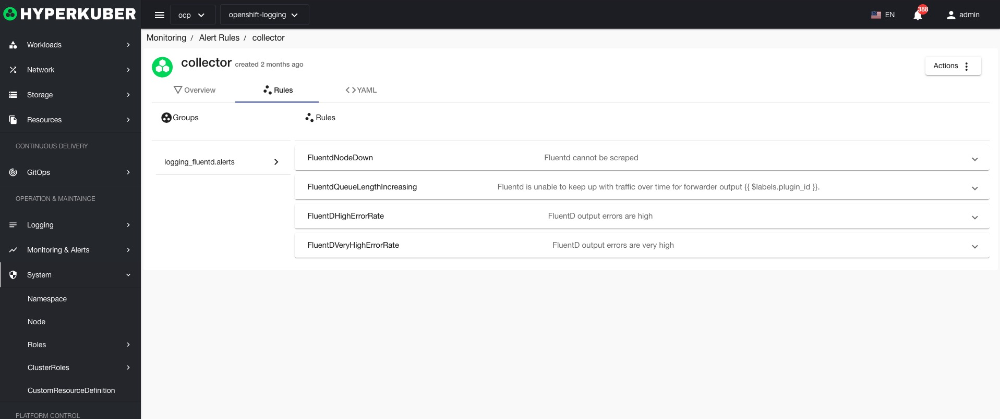
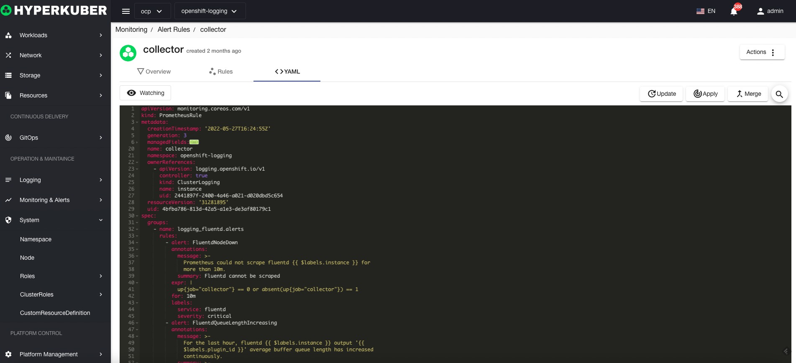

# Alert rules

## Alert rules
Alarm rules display the existing alarm rules of the cluster project

## Alert rule action

### Create
Click the "Create" button to enter the creation page and fill in the necessary parameters:

### Details

* Label
Supports modifying the Label information of alarm rules

*Annotations
Supports modifying the Annotation information of alarm rules

* Yaml
Support modifying Yaml information of alarm rules

### delete
Select the silent rule to be deleted, click the "Delete button", and enter "yes" in the confirmation input box to complete the deletion operation.
### refresh
Click "Refresh" to complete the refresh of the application list.