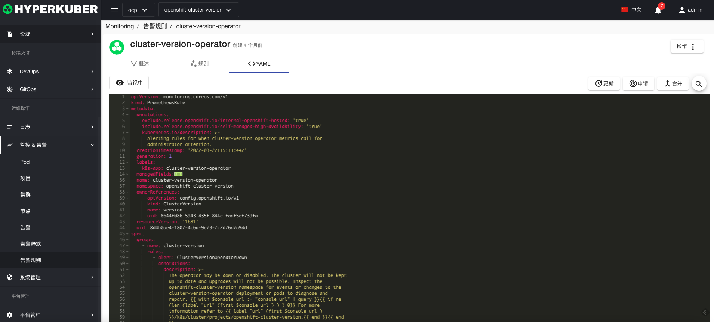

# 告警规则

## 告警规则
告警规则显示集群项目已存在的告警规则

## 告警规则操作

### 创建
点击“创建”按钮，进入创建页面，填写必要参数：

### 详情

* Label
支持修改告警规则的Label信息

* Annotations
支持修改告警规则的Annotation信息

* Yaml
支持修改告警规则的Yaml信息

### 删除
选择需要删除的静默规则，点击“删除按钮”，在确定输入框输入“yes”，即可完成删除操作。
### 刷新
点击“刷新”，即可完成应用列表的刷新。