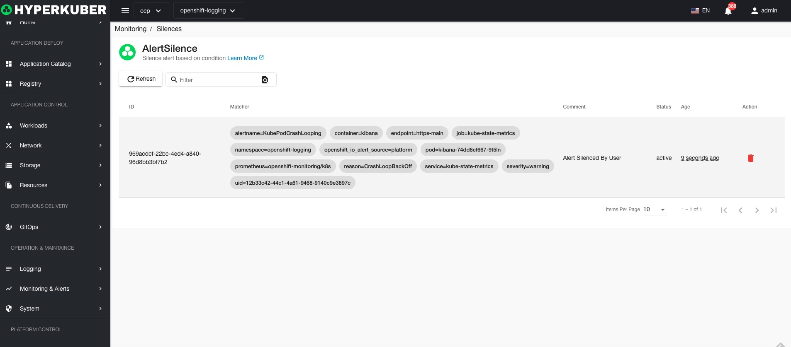

# silent

#### create

parameter settings:
* Silent rule start time
* Deadline for silent rules
* Matchers: used to match alarms generated by alarm rules, refer to: https://github.com/prometheus/alertmanager/blob/main/api/v2/openapi.yaml
* creator
* Submit summary

Create successfully jump to the list page

#### delete
Select the silent rule to be deleted, click the "Delete button", and enter "yes" in the confirmation input box to complete the deletion operation.