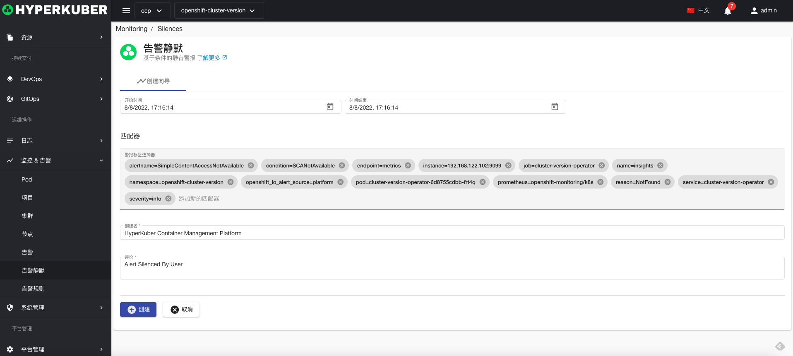

# 静默

#### 创建

参数设置：
* 静默规则开始时间
* 静默规则截止时间
* Matchers： 用于匹配告警规则产生的告警，参照：https://github.com/prometheus/alertmanager/blob/main/api/v2/openapi.yaml
* 创建者
* 提交概要

创建成功跳转至列表页面

#### 删除
选择需要删除的静默规则，点击“删除按钮”，在确定输入框输入“yes”，即可完成删除操作。