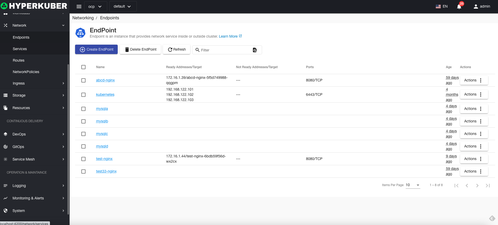
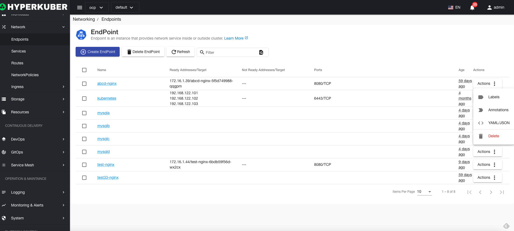
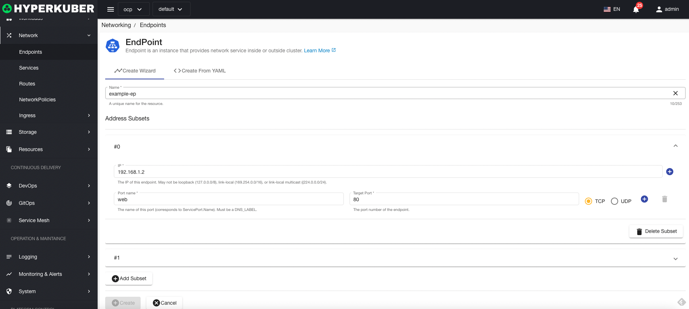
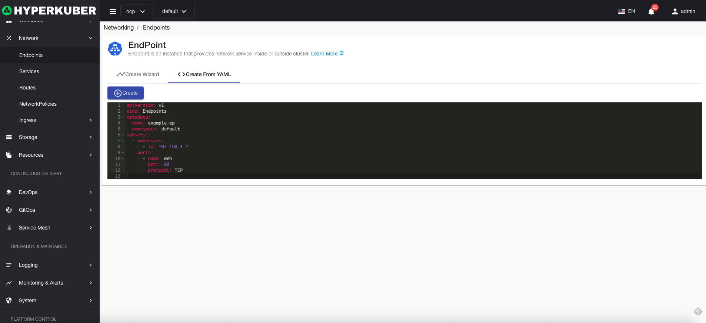
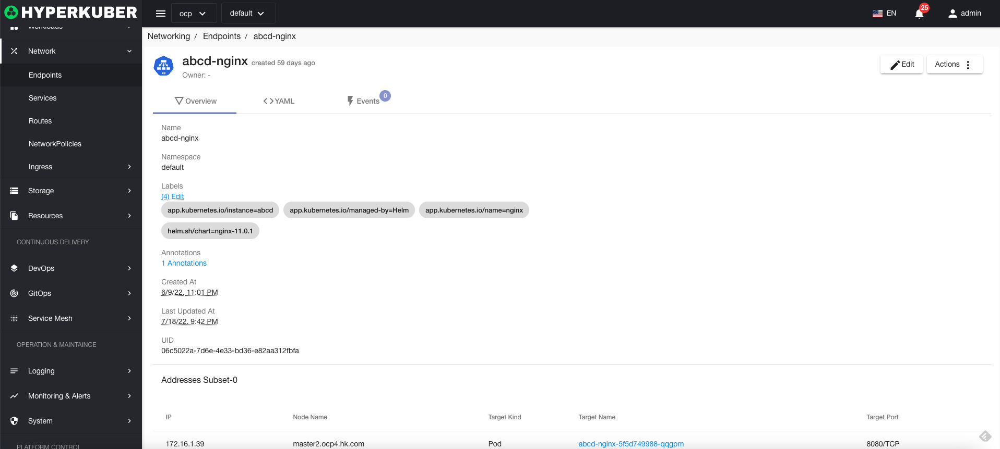
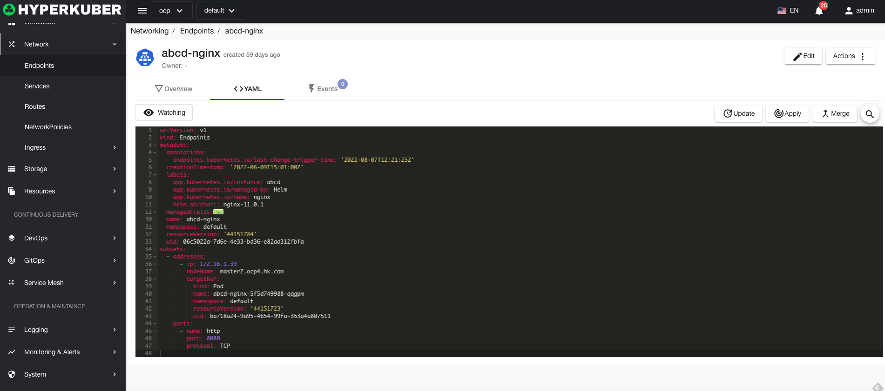
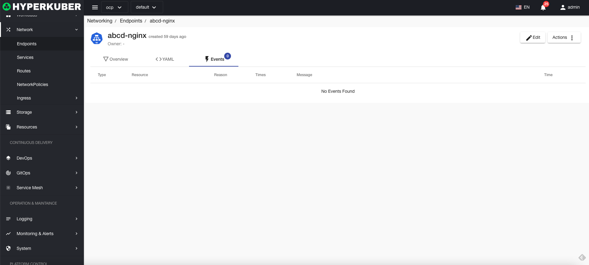
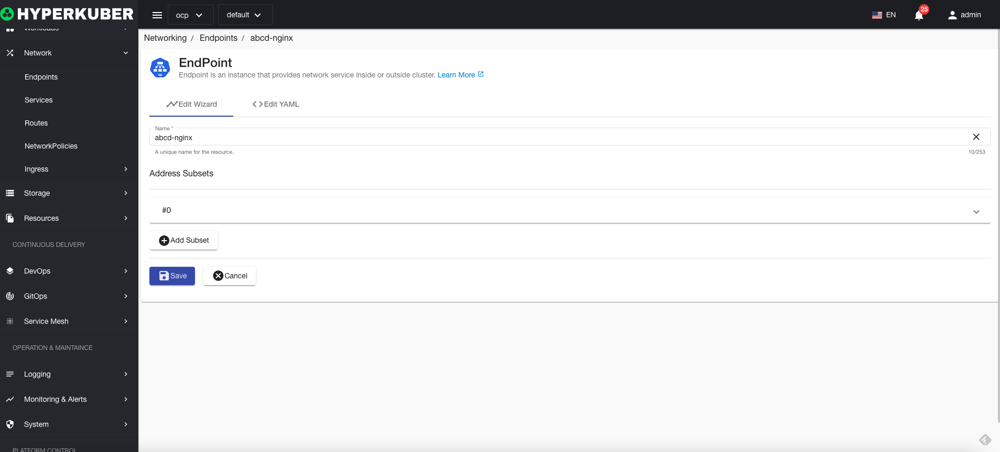
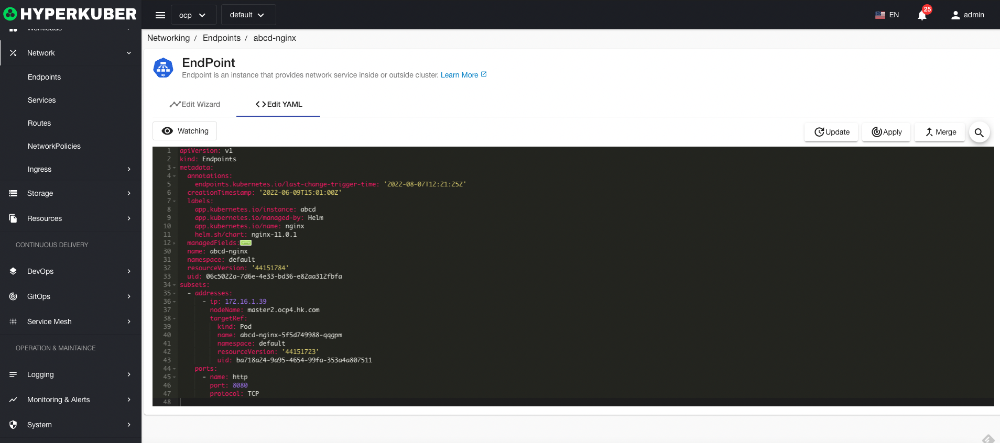

# endpoint

An endpoint is an instance that provides network services inside and outside the cluster

## Endpoint operations

The following interface graphical operations are supported:

* Label
* Notes
* Yaml/Json editing

### Create
Create an endpoint, click the "Create endpoint" button, enter the create endpoint page, fill in the necessary parameters

parameter
name: endpoint name
Subset of addresses: IP address, port name, destination port, and protocol TCP/UDP

### Yaml create
Endpoints can be created directly from Yaml files

### Endpoint Details
Click on the link of the endpoint name to go to the details page of the endpoint
Overview information

Yaml information

event information

### edit
Select the endpoint to be edited, click the "Edit" button, enter the edit endpoint page, and modify the necessary parameters to complete the deletion operation.
* Support graphical modification of service parameters

* Support Yaml modification

### delete
Select the endpoint to be deleted, click the multi-select box to select, click the "Delete button", and enter "yes" in the confirmation input box to complete the deletion operation.
### refresh
Click "Refresh" to complete the refresh of the endpoint list.