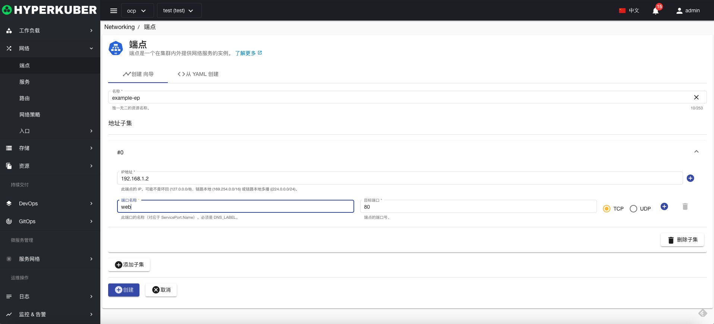

# 端点

端点是一个在集群内外提供网络服务的实例

## 端点操作

支持以下界面图形化操作：

* 标签
* 注解
* Yaml/Json编辑

### 创建
创建端点，点击“创建端点”按钮，进入创建端点页面，填写必要参数

参数
名称：端点名称
地址子集：IP地址，端口名称，目标端口以及协议TCP/UDP

### Yaml创建
端点可通过Yaml文件直接创建

### 端点详情
点击端点名称的链接，即可进入端点的详情页面
概览信息

Yaml信息

事件信息

### 编辑
选择需要编辑的端点，点击”编辑“按钮，进入编辑端点页面，修改必要参数，即可完成删除操作。
* 支持图形化修改服务参数

* 支持Yaml修改

### 删除
选择需要删除的端点，点击多选框选择，点击“删除按钮”，在确定输入框输入“yes”，即可完成删除操作。
### 刷新
点击“刷新”，即可完成端点列表的刷新。

