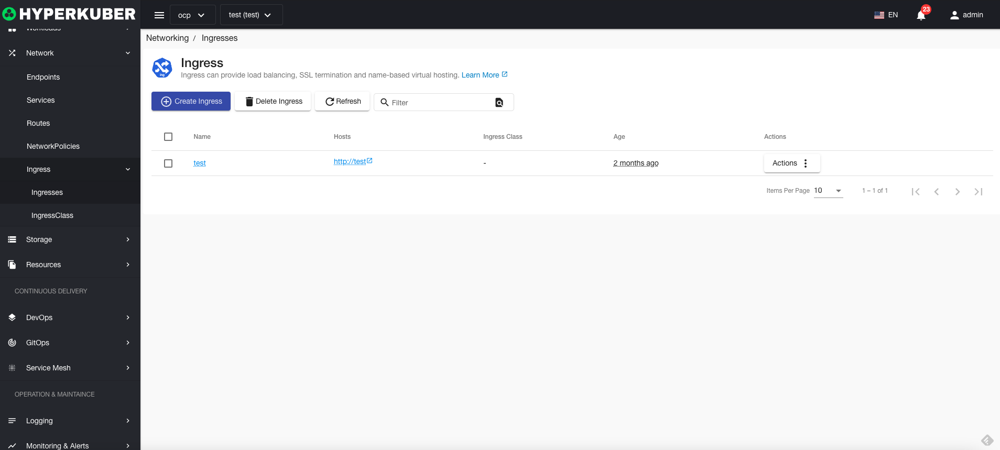
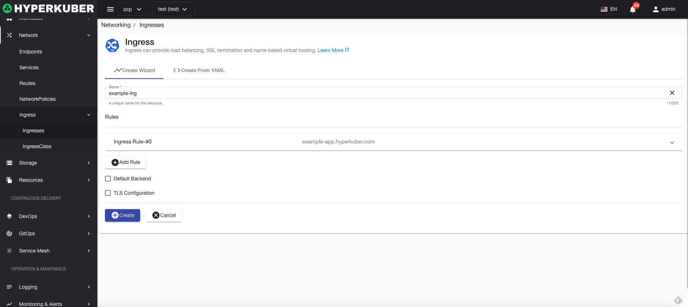
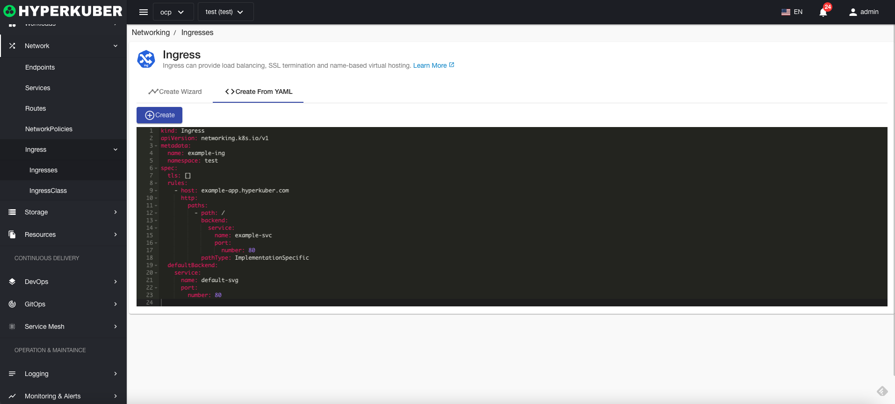
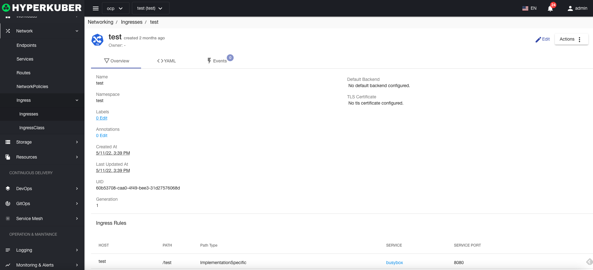
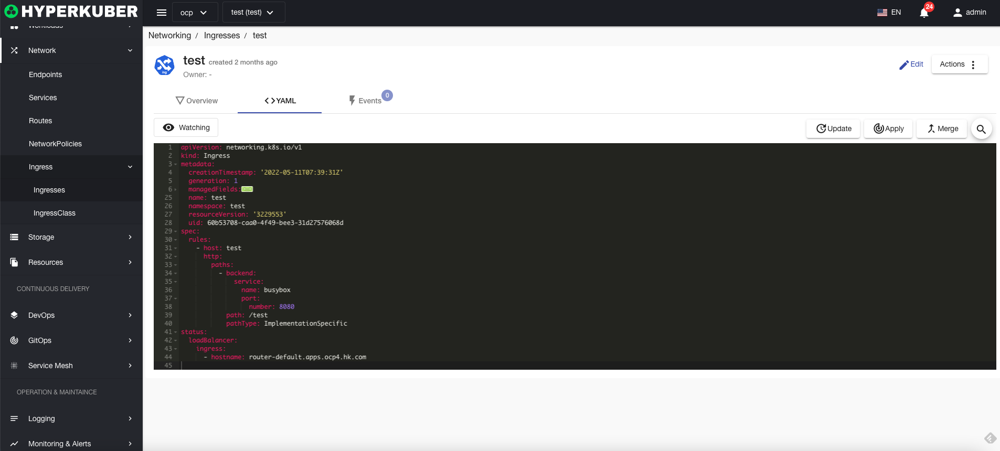
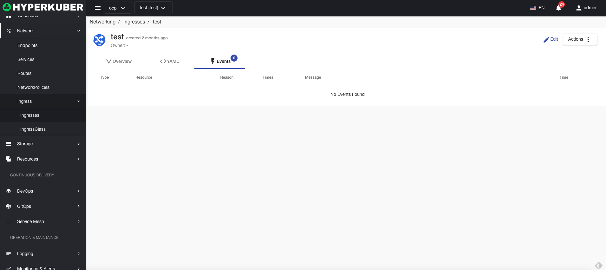
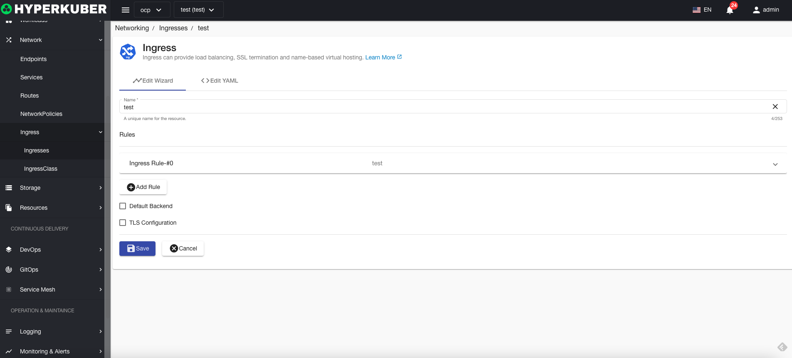

# Entrance

Ingress can provide load balancing, SSL termination, and name-based virtual hosting.

## entry operation

The following interface graphical operations are supported:

* Label
* Notes
* Yaml/Json editing

### Create
Create an entry, click the "Create Entry" button, enter the entry creation page, and fill in the necessary parameters

parameter
name: entry name
Entry rules:
* host: Ingress host name
* path: entry path
* Path type: entry type,
ImplementationSpecific
Exact
Prefix
* Service: Ingress forwarding service
* Port: Ingress forwarding service port

### Yaml create
Entry can be created directly through Yaml file

### Entry Details
Click on the link of the entrance name to go to the entrance details page
Overview information

Yaml information

event information

### edit
Select the entry to be edited, click the "Edit" button, enter the edit entry page, and modify the necessary parameters to complete the deletion operation.
* Support graphical modification of entry parameters

* Support Yaml modification

### delete
Select the entry to be deleted, click the multi-select box to select, click the "Delete button", and enter "yes" in the confirmation input box to complete the deletion operation.
### refresh
Click "Refresh" to complete the refresh of the entry list.