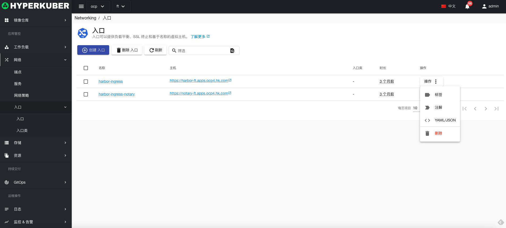
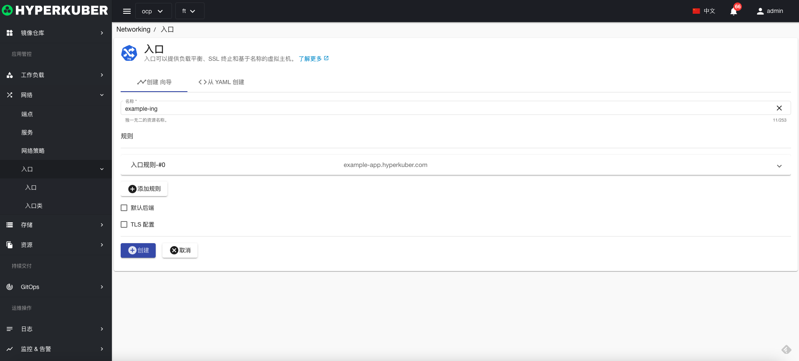
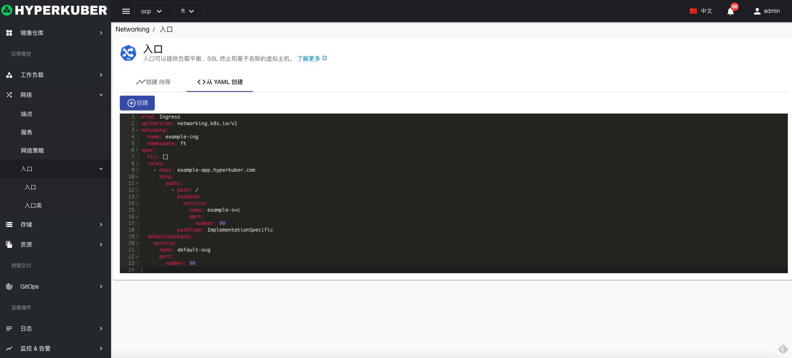
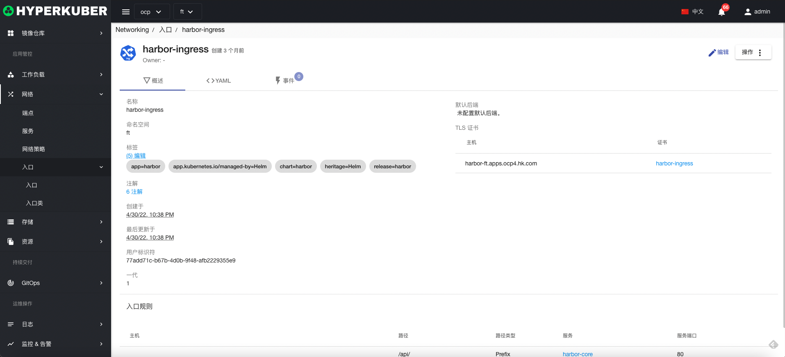
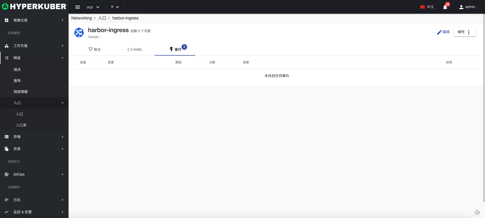
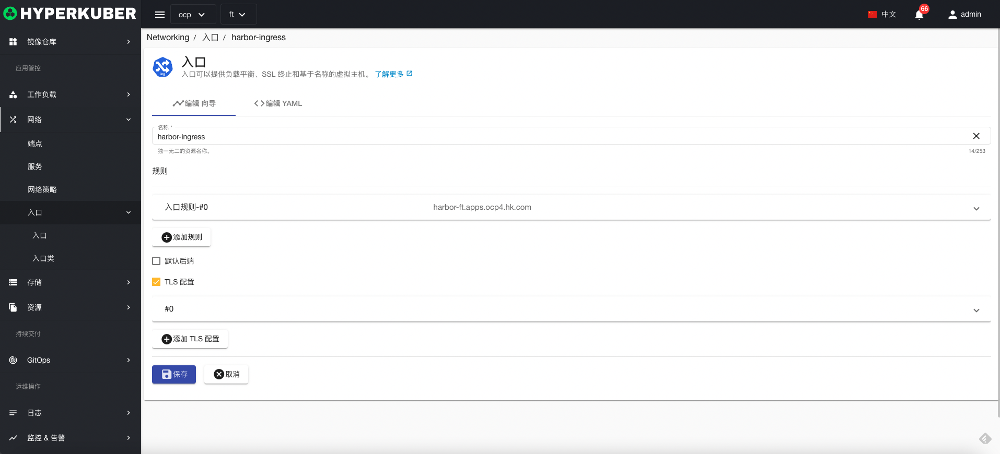
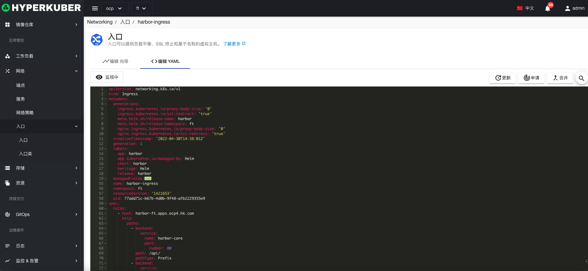

# 入口

入口可以提供负载平衡、SSL 终止和基于名称的虚拟主机。

## 入口操作

支持以下界面图形化操作：

* 标签
* 注解
* Yaml/Json编辑

### 创建
创建入口，点击“创建入口”按钮，进入创建入口页面，填写必要参数

参数
名称：入口名称
入口规则： 
* 主机：入口主机名称
* 路径：入口路径
* 路径类型：入口类型，
ImplementationSpecific
Exact
Prefix
* 服务：入口转发服务
* 端口：入口转发服务端口

### Yaml创建
入口可通过Yaml文件直接创建

### 入口详情
点击入口名称的链接，即可进入入口的详情页面
概览信息

Yaml信息

事件信息

### 编辑
选择需要编辑的入口，点击”编辑“按钮，进入编辑入口页面，修改必要参数，即可完成删除操作。
* 支持图形化修改入口参数

* 支持Yaml修改

### 删除
选择需要删除的入口，点击多选框选择，点击“删除按钮”，在确定输入框输入“yes”，即可完成删除操作。
### 刷新
点击“刷新”，即可完成入口列表的刷新。