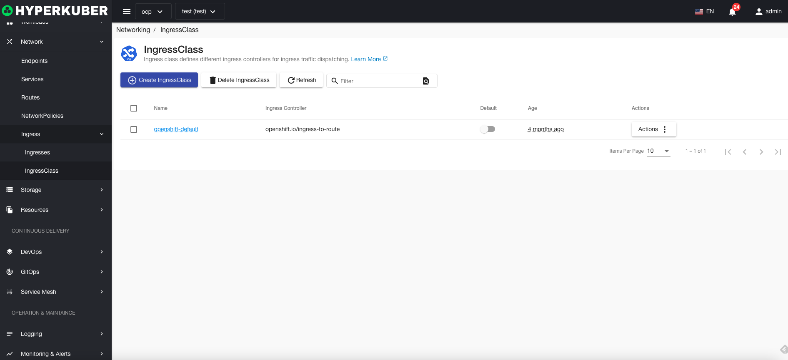
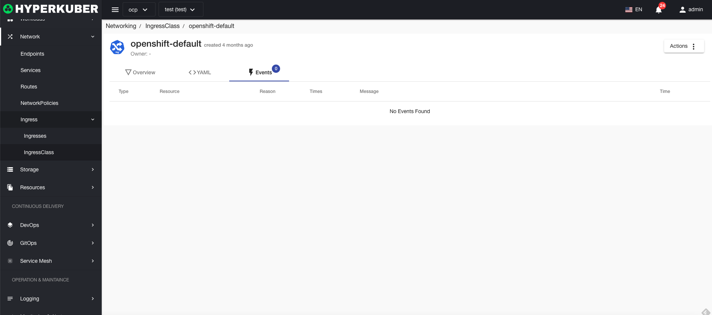

# entry class

The ingress class defines different ingress controllers for ingress traffic scheduling.

## Entry class operation

The following interface graphical operations are supported:

* Label
* Notes
* Yaml/Json editing

### Yaml create
The entry class can be created directly through the Yaml file

### Entry class details
Click the link of the entry class name to enter the entry class details page
Overview information

Yaml information

event information

### delete
Select the entry class to be deleted, click the multi-select box to select, click the "Delete button", and enter "yes" in the confirmation input box to complete the deletion operation.
### refresh
Click "Refresh" to complete the refresh of the entry class list.