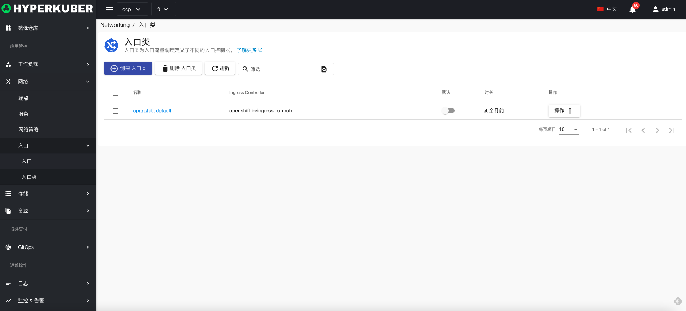
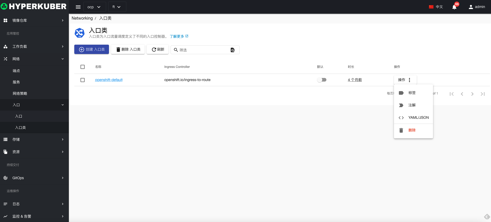
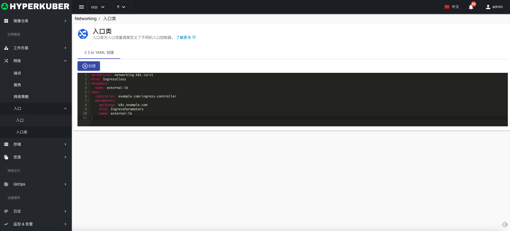
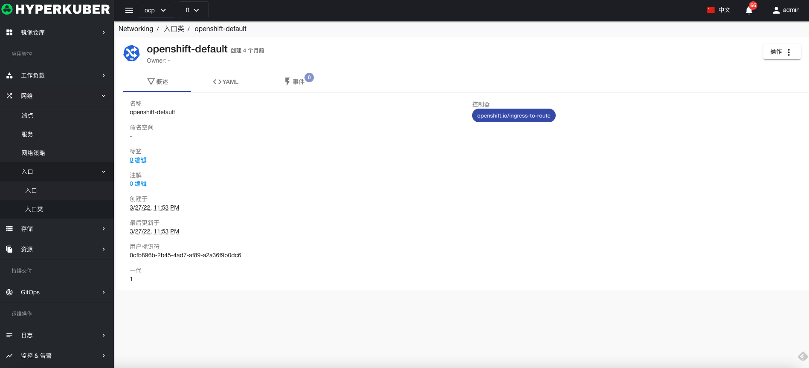
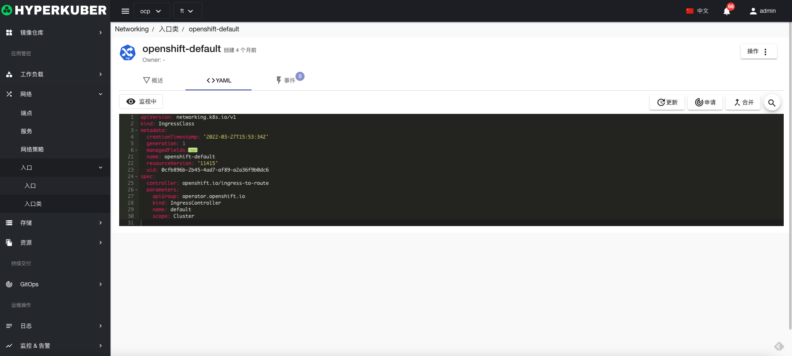
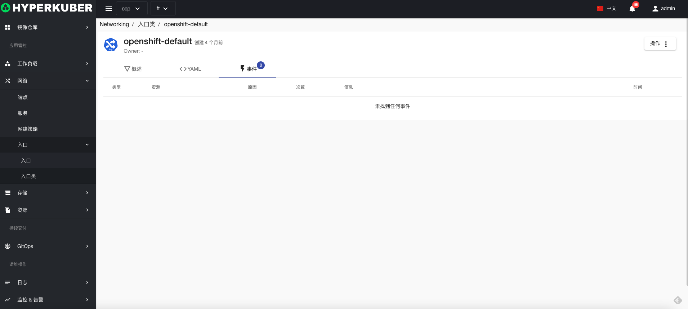

# 入口类

入口类为入口流量调度定义了不同的入口控制器。

## 入口类操作

支持以下界面图形化操作：

* 标签
* 注解
* Yaml/Json编辑

### Yaml创建
入口类可通过Yaml文件直接创建

### 入口类详情
点击入口类名称的链接，即可进入入口类的详情页面
概览信息

Yaml信息

事件信息

### 删除
选择需要删除的入口类，点击多选框选择，点击“删除按钮”，在确定输入框输入“yes”，即可完成删除操作。
### 刷新
点击“刷新”，即可完成入口类列表的刷新。