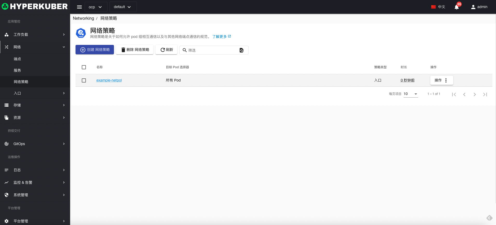
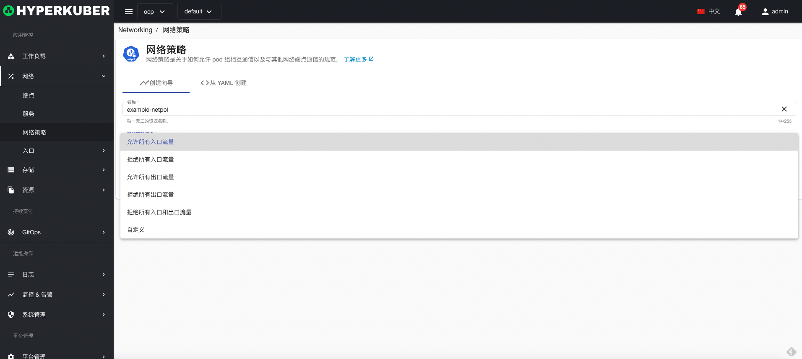
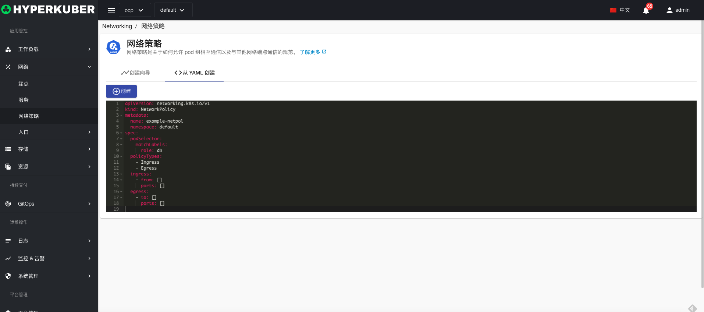
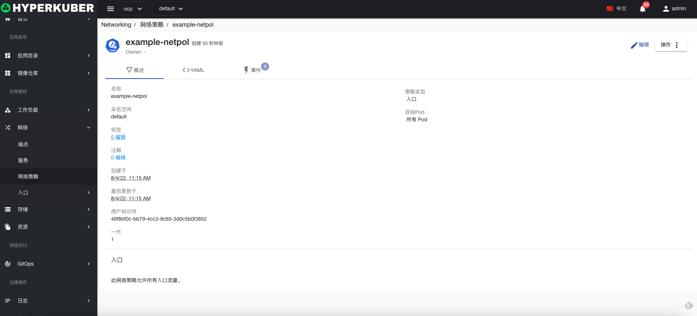
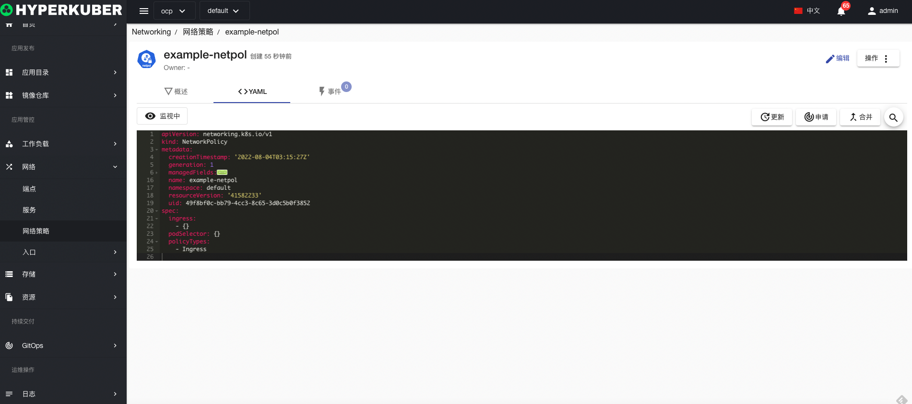
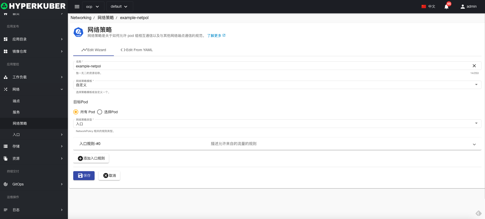

# 网络策略

网络策略是关于如何允许 pod 组相互通信以及与其他网络端点通信的规范

## 网络策略操作

支持以下界面图形化操作：

* 标签
* 注解
* Yaml/Json编辑

### 创建
创建网络策略，点击“创建网络策略”按钮，进入创建网络策略页面，填写必要参数

参数
名称：网络策略名称
网络策略模版： 
* 允许所有入口流量
* 拒绝所有入口流量
* 允许所有出口流量
* 拒绝所有出口流量
* 拒绝所有入口和出口流量
* 自定义：用户可以自定义网路流量限制

### Yaml创建
网络策略可通过Yaml文件直接创建

### 网络策略详情
点击网络策略名称的链接，即可进入网络策略的详情页面
概览信息

Yaml信息

事件信息

### 编辑
选择需要编辑的网络策略，点击”编辑“按钮，进入编辑网络策略页面，修改必要参数，即可完成删除操作。
* 支持图形化修改网络策略参数

* 支持Yaml修改

### 删除
选择需要删除的网络策略，点击多选框选择，点击“删除按钮”，在确定输入框输入“yes”，即可完成删除操作。
### 刷新
点击“刷新”，即可完成网络策略列表的刷新。